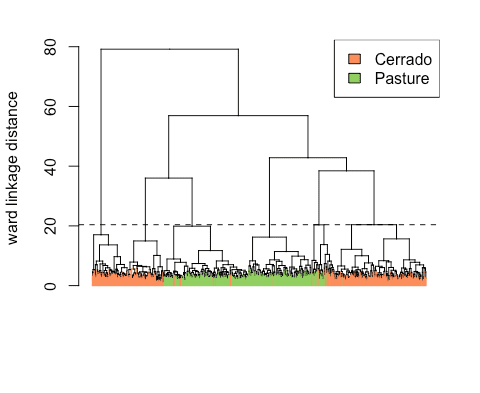
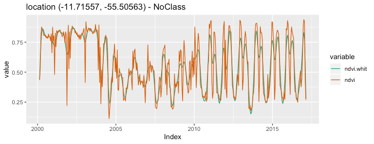
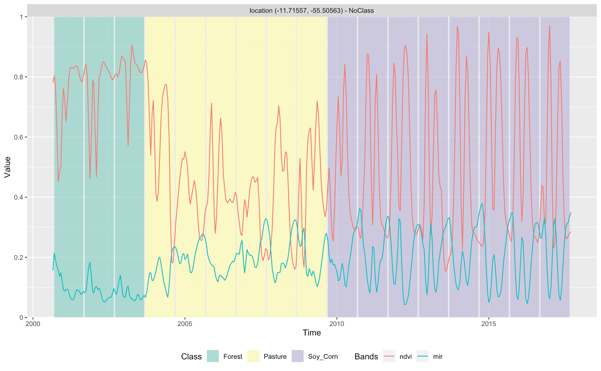

```{r, echo = FALSE}
knitr::opts_chunk$set(
  collapse = TRUE,
  comment = "#>",
  fig.path = "man/figures/README-"
)
```

### Overview

The SITS package provides a set of tools for analysis, visualization and classification of satellite image time series. It includes methods for filtering, clustering, classification, and post-processing. 

### Vignettes

  - [“SITS: Data Analysis and Machine Learning for Data Cubes using
    Satellite Image Time
    Series”](https://github.com/e-sensing/sits-docs/blob/master/vignettes/sits.pdf)

  - [“Clustering of Satellite Image Time Series with
    SITS”](https://github.com/e-sensing/sits-docs/blob/master/vignettes/clustering.pdf)

  - [“Satellite Image Time Series Filtering with
    SITS”](https://github.com/e-sensing/sits-docs/blob/master/vignettes/filtering.pdf)

  - [“Time Series classification using machine
    learning”](https://github.com/e-sensing/sits-docs/blob/master/vignettes/machine_learning.pdf)

  - [“Post classification smoothing using Bayesian techniques in
    SITS”](https://github.com/e-sensing/sits-docs/blob/master/vignettes/smoothing.pdf)
    
### Installation

Please install the SITS package from github, making sure you have the latest version of the other packages it requires:

```{r, eval = FALSE}
devtools::install_github("e-sensing/sits")
library(sits)

# Retrieve the data available in the "inSitu" package (used for some examples)
devtools::install_github("e-sensing/inSitu")
library(inSitu)
```

### Data Access and Visualisation

**sits** allows different methods of data input, including: (a) obtain data from a time series web services such as INPE's WTSS (Web Series Time Service) or EMBRAPA's SATVEG; (b) read data stored in a time series in the ZOO format [@Zeileis2005]; (c) read a time series from a TIFF RasterBrick; (d) Read images organized in data cubes using the EOCUbes packages. More services will be added in future releases.

### Visualization

```{r, eval = TRUE, echo = FALSE}
library(sits)
library(tibble)
```


```{r, eval = TRUE}
cerrado_2classes[1:3,]
```

After a time series is imported, it is loaded in a tibble. The first six columns contain the metadata: spatial and temporal location, label assigned to the sample, and coverage from where the data has been extracted. The spatial location is given in longitude and latitude coordinates for the "WGS84" ellipsoid. For example, the first sample has been labelled "Pasture", at location (-55.1852, -10.8387), and is considered valid for the period (2013-09-14, 2014-08-29). To display the time series, use the `plot()` function. For a large number of samples, where the amount of individual plots would be substantial, the default visualisation combines all samples together in a single temporal interval. 

```{r eval = FALSE}
# select the "ndvi" band
samples_ndvi <- sits_select_bands(samples_mt_4bands, ndvi)
# select only the samples with the cerrado label
samples_cerrado <- dplyr::filter(samples_ndvi, 
                  label == "Cerrado")
plot(samples_cerrado)
```

```{r, echo = FALSE, fig.align="center", fig.height=3, fig.width=5, fig.cap= "Samples for NDVI band for Cerrado class"}
knitr::include_graphics("./inst/extdata/markdown/figures/samples_cerrado.png")
```

### Clustering

Clustering methods in SITS improve the quality of the samples and to remove those that might have been wrongly labeled or that have low discriminatory power. Good samples lead to good classification maps. `sits` provides support for two clustering methods to test sample quality: (a) Agglomerative Hierarchical Clustering (AHC); (b)  Self-organizing Maps (SOM). Full details of the cluster methods used in SITS are available in the vignette 'Clustering of Satellite Image Time Series with SITS'. The following example shows how to create a dendrogram and associated clusters for a dataset with two classes ("pasture" and "cerrado") for the Cerrado biome in Brasil. For more details, please see the vignette [“Clustering of Satellite Image Time Series with SITS”](https://github.com/e-sensing/sits-docs/blob/master/vignettes/clustering.pdf)


```{r eval = FALSE}
# take a set of patterns for 2 classes
# create a dendrogram object with default clustering parameters
clusters.tb <- sits_cluster_dendro(cerrado_2classes)
```

```{r, echo = FALSE, fig.align="center", fig.height=3, fig.width=5, fig.cap = "Dendrogram for samples of classes Pasture and Cerrado"}

```


## Filtering

Satellite image time series are contaminated by atmospheric influence and directional effects. To make the best use of available satellite data archives, methods for satellite image time series analysis need to deal with data sets that are *noisy* and *non-homogeneous*. For data filtering, `sits` supports Savitzky–Golay (`sits_sgolay()`), Whittaker (`sits_whittaker()`), envelope (`sits_envelope()`) and the "cloud filter" (`sits_cloud_filter()`). As an example, we show how to apply the Whitakker smoother to a 16-year NDVI time series. For more details, please see the vignette [“Satellite Image Time Series Filtering with SITS”](https://github.com/e-sensing/sits-docs/blob/master/vignettes/filtering.pdf)


```{r, eval = FALSE}
# apply Whitaker filter to a time series sample for the NDVI band from 2000 to 2016
# merge with the original data
# plot the original and the modified series
point_whit <- sits_filter(point_ndvi, sits_whittaker(lambda = 10))
point_whit %>% 
  sits_merge(point_ndvi) %>% 
  plot()
```

```{r, echo = FALSE, fig.align="center", fig.height=3, fig.width=5, fig.cap="Whittaker smoother filter applied on one-year NDVI time series. The example uses default $\\lambda=1$ parameter."}

```


## Time Series classification using machine learning 

SITS provides support for the classification of both individual time series as well as data cubes. The following machine learning methods are available in SITS:

* Linear discriminant analysis (`sits_lda`)
* Quadratic discriminant analysis (`sits_qda`)
* Multinomial logit and its variants 'lasso' and 'ridge' (`sits_mlr`)
* Support vector machines (`sits_svm`)
* Random forests (`sits_rfor`)
* Extreme gradient boosting (`sits_xgboost`)
* Deep learning (DL) using multi-layer perceptrons (`sits_deeplearning`)
* DL with 1D convolutional neural networks (`sits_FCN`) 
* DL combining 1D CNN and multi-layer perceptron networks (`sits_TempCNN`)
* DL using 1D version of ResNet (`sits_ResNet`)
* DL using a combination of long-short term memory (LSTM) and 1D CNN (`sits_LSTM_FCN`)


The following example illustrate how to train a dataset and classify an individual time series. First we use the `sits_train` function with two parameters: the training dataset (described above) and the chosen machine learning model (in this case, a random forest classifier). The trained model is then used to classify a time series from Mato Grosso Brazilian state, using `sits_classify`. The results can be shown in text format using the function `sits_show_prediction` or graphically using `plot`.

```{r, eval = FALSE}

# Train a machine learning model for the mato grosso dataset using Extreme Gradient Boosting
rfor_model <- sits_train(data = samples_mt_4bands, ml_method = sits_rfor(num_trees = 500))

# get a point to be classified with four bands
point_mt_4bands <- sits_select_bands(point_mt_6bands, ndvi, evi, nir, mir)

# filter the point with a Whittaker smoother
point_filtered <- sits_whittaker(point_mt_4bands, lambda = 0.2, bands_suffix = "") 

# Classify using random forest model and plot the result
class.tb <- sits_classify(point_filtered, rfor_model)
# plot the results of the prediction
plot(class.tb, bands = c("ndvi", "mir"))
```

```{r, echo = FALSE, fig.align="center", fig.height=3, fig.width=5, fig.cap="XGBoost classification of a $16$ years time series"}

```


The following example shows how to classify a data cube organised as a set of raster bricks. First, we ned to build a model based on the the same bands as the data cube.

```{r, eval = FALSE}
# estimate a model only for bands "ndvi" and "evi"
samples_mt_2bands <- sits_select_bands(samples_mt_4bands, ndvi, evi)
xgb_model_ndvi_evi <- sits_train(samples_mt_2bands, ml_method = sits_xgboost())
# Create a data cube from two raster bricks
evi_file <- system.file("extdata/Sinop", "Sinop_evi_2014.tif", package = "inSitu")
ndvi_file <- system.file("extdata/Sinop", "Sinop_ndvi_2014.tif", package = "inSitu")

# Obtain the associated timeline
time_file <- system.file("extdata/Sinop", "timeline_2014.txt", package = "inSitu")
timeline_2013_2014 <- scan(time_file, character(), quiet = TRUE)

# create a raster metadata file based on the information about the files
raster_cube <- sits_cube(name = "Sinop", timeline = timeline_2013_2014, bands = c("ndvi", "evi"), files = c(ndvi_file, evi_file))
# Classify the raster cube, generating a probability file
probs_cube <- sits_classify(raster_cube, ml_model = xgb_model_ndvi_evi)

# label the probability file (by default selecting the class with higher probability)
# apply a bayesian smoothing to remove outliers
label_cube <- sits_label_classification(probs_cube, smoothing = "bayesian")

# plot the first raster object with a selected color pallete
# make a title, define the colors and the labels)
plot(label_cube, time = 1, title = "SINOP-MT - 2013/2014")
```

```{r, echo = FALSE, fig.align="center", fig.height=3.4, fig.width=5.5, fig.cap="Image classified with XGBoost"}
knitr::include_graphics("./inst/extdata/markdown/figures/sinop_bayes.png")
```

For more details, please see the vignettes [“Time Series classification using machine learning”](https://github.com/e-sensing/sits-docs/blob/master/vignettes/machine_learning.pdf) and [“Post classification smoothing using Bayesian techniques in SITS”](https://github.com/e-sensing/sits-docs/blob/master/vignettes/smoothing.pdf)

#### Package status of SITS version 0.9.3

| |Status|
|---|---|
|Code Build | [](http://www.dpi.inpe.br/jenkins/job/sits-build-ubuntu-16.04/lastBuild/consoleFull)|
|Code Check |[](http://www.dpi.inpe.br/jenkins/job/sits-check-ubuntu-16.04/lastBuild/consoleFull)|
|Code Documentation |[](http://www.dpi.inpe.br/jenkins/job/sits-documentation-ubuntu-16.04/lastBuild/consoleFull)|
|Code Coverage |[](http://www.dpi.inpe.br/jenkins/job/sits-covr-ubuntu-16.04/lastBuild/consoleFull)|
| Test Coverage | [](https://codecov.io/github/e-sensing/sits?branch=master) |
| Project Status | [](https://www.tidyverse.org/lifecycle/#maturing) |
| Lifecycle | [](https://www.tidyverse.org/lifecycle/#maturing) |


[](https://zenodo.org/badge/latestdoi/98539507)

#### License

The **sits** package is licensed under the GPLv3 (<http://www.gnu.org/licenses/gpl.html>).
