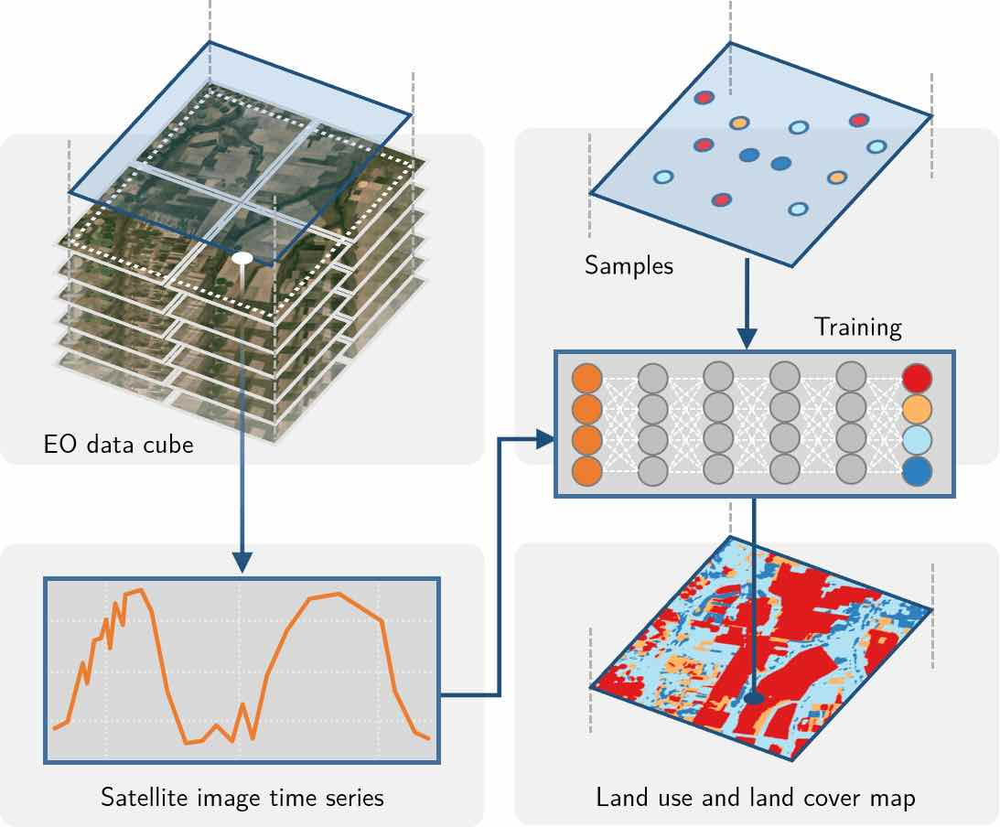
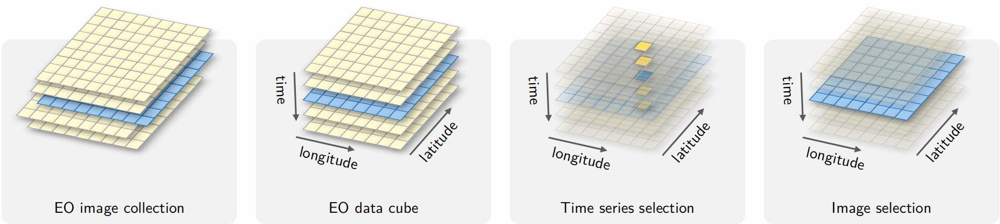
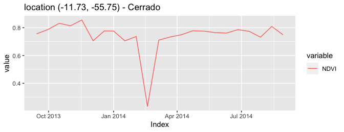
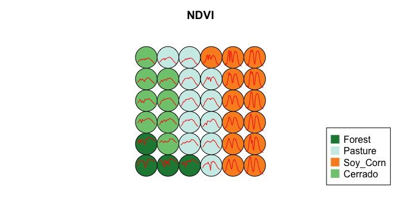

SITS - Satellite Image Time Series Analysis for Earth Observation Data
Cubes
================

<!-- README.md is generated from README.Rmd. Please edit that file -->


<!-- badges: start -->
<!-- [](https://drone.dpi.inpe.br/e-sensing/sits) -->

[](https://cran.r-project.org/package=sits)
[](https://github.com/e-sensing/sits/actions/workflows/R-CMD-check.yaml)
[](https://codecov.io/gh/e-sensing/sits)
[](https://e-sensing.github.io/sitsbook/)
[](https://lifecycle.r-lib.org/articles/stages.html)
[](https://github.com/e-sensing/sits/blob/master/LICENSE)
<!-- badges: end -->

## Overview

`sits` is an open source R package for satellite image time series
analysis. It enables users to apply machine learning techniques for
classifying image time series obtained from earth observation data
cubes. The basic workflow in `sits` is:

1.  Select an image collection available on cloud providers AWS,
    Microsoft Planetary Computer, Digital Earth Africa and Brazil Data
    Cube.
2.  Build a regular data cube using analysis-ready image collections.
3.  Extract labelled time series from data cubes to be used as training
    samples.
4.  Perform quality control using self-organised maps.
5.  Filtering time series samples for noise reduction.
6.  Use the samples to train machine learning models.
7.  Tune machine learning models for improved accuracy.
8.  Classify data cubes using machine learning models.
9.  Post-process classified images with Bayesian smoothing to remove
    outliers.
10. Estimate uncertainty values of classified images.
11. Evaluate classification accuracy using best practices.
12. Improve results with active learning and self-supervised learning
    methods.

<div class="figure" style="text-align: center">


<p class="caption">
Conceptual view of data cubes (source: authors)
</p>

</div>

## Documentation

Detailed documentation on how to use `sits` is available in the e-book
[“Satellite Image Time Series Analysis on Earth Observation Data
Cubes”](https://e-sensing.github.io/sitsbook/).

## `sits` on Kaggle

Those that want to evaluate the `sits` package before installing are
invited to run the examples available on
[Kaggle](https://www.kaggle.com/esensing/code). These examples provide a
fast-track introduction to the package. We recommend running them in the
following order:

1.  [Introduction to
    SITS](https://www.kaggle.com/esensing/introduction-to-sits)
2.  [Working with time series in
    SITS](https://www.kaggle.com/esensing/working-with-time-series-in-sits)
3.  [Creating data cubes in
    SITS](https://www.kaggle.com/esensing/creating-data-cubes-in-sits)
4.  [Raster classification in
    SITS](https://www.kaggle.com/esensing/raster-classification-in-sits)
5.  [Using SOM for sample quality control in
    SITS](https://www.kaggle.com/esensing/using-som-for-sample-quality-control-in-sits)

## Installation

### Pre-Requisites

The `sits` package relies on the geospatial packages `sf`, `stars`,
`gdalcubes` and `terra`, which depend on the external libraries GDAL and
PROJ. Please follow the instructions for installing `sf` together with
GDAL available at the [RSpatial sf github
repository](https://github.com/r-spatial/sf).

### Obtaining `sits`

`sits` can be installed from CRAN:

``` r
install.packages("sits")
```

The development version is available on github.

``` r
devtools::install_github("e-sensing/sits", dependencies = TRUE)
```

``` r
# load the sits library
library(sits)
#> SITS - satellite image time series analysis.
#> Loaded sits v1.4.0.
#>         See ?sits for help, citation("sits") for use in publication.
#>         Documentation avaliable in https://e-sensing.github.io/sitsbook/.
```

## Building Earth Observation Data Cubes

### Image Collections Accessible by `sits`

The `sits` package allows users to created data cubes from
analysis-ready data (ARD) image collections available in cloud services.
The collections accessible in `sits` 1.4.0 are:

1.  Brazil Data Cube
    ([BDC](http://brazildatacube.org/en/home-page-2/#dataproducts)):
    Open data collections of Sentinel-2, Landsat-8 and CBERS-4 images.
2.  Microsoft Planetary Computer
    ([MPC](https://planetarycomputer.microsoft.com/catalog)): Open data
    collection of Sentinel-2/2A and Landsat-8
3.  Earth on AWS ([AWS](https://aws.amazon.com/earth/)): Sentinel-2/2A
    level 2A collections.
4.  Digital Earth Africa
    ([DEAFRICA](https://www.digitalearthafrica.org/)): Open data
    collection of Sentinel-2/2A and Landsat-8 for Africa.
5.  [USGS](https://landsatlook.usgs.gov/stac-browser): Landsat-4/5/7/8
    collections, which are not open data.
6.  Swiss Data Cube ([SDC](https://www.swissdatacube.org/)): Open data
    collection of Sentinel-2/2A and Landsat-8.

Open data collections do not require payment of access fees. Except for
those in the Brazil Data Cube, these collections are not regular.
Irregular collections require further processing before they can be used
for classification using machine learning models.

### Building a Data Cube from an ARD Image Collection

The following code defines an irregular data cube of Sentinel-2/2A
images available in the Microsoft Planetary Computer, using the open
data collection `"SENTINEL-2-L2A"`. The geographical area of the data
cube is defined by the tiles `"20LKP"` and `"20LLKP"`, and the temporal
extent by a start and end date. Access to other cloud services works in
similar ways.

``` r
s2_cube <- sits_cube(
  source = "MPC",
  collection = "SENTINEL-2-L2A",
  tiles = c("20LKP", "20LLP"),
  bands = c("B03", "B08", "B11", "SCL"),
  start_date = as.Date("2018-07-01"),
  end_date = as.Date("2019-06-30"),
  progress = FALSE
)
```

This cube is irregular. The timelines of tiles `"20LKP"` and `"20LLKP"`
and the resolutions of the bands are different. Sentinel-2 bands `"B03"`
and `"B08"` have 10-meters resolution, while band `"B11"` and the cloud
band `"SCL"` have 20-meters resolution. Irregular collections need an
additional processing step to be converted to regular data cubes, as
described below.

<div class="figure" style="text-align: center">


<p class="caption">
Conceptual view of data cubes (source: authors)
</p>

</div>

After defining an irregular ARD image collection from a cloud service
using `sits_cube()`, users should run `sits_regularize()` to build a
regular data cube. This function uses the [gdalcubes R
package](https://github.com/appelmar/gdalcubes), described in [Appel and
Pebesma, 2019](https://www.mdpi.com/2306-5729/4/3/92).

``` r
gc_cube <- sits_regularize(
  cube          = s2_cube,
  output_dir    = tempdir(),
  period        = "P15D",
  res           = 60,
  multicores    = 4
)
```

The above command builds a regular data cube with all bands interpolated
to 60 m spatial resolution and 15-days temporal resolution. Regular data
cubes are the input to the `sits` functions for time series retrieval,
building machine learning models, and classification of raster images
and time series.

The cube can be shown in a leaflet using `sits_view()`.

``` r
# View a color composite on a leaflet
sits_view(s2_cube[1,], green = "B08", blue = "B03", red = "B11")
```

## Working with Time Series in `sits`

### Accessing Time Series in Data Cubes

`sits` has been designed to use satellite image time series to derive
machine learning models. After the data cube has been created, time
series can be retrieved individually or by using CSV or SHP files, as in
the following example. The example below uses a data cube in a local
directory, whose images have been obtained from the `"MOD13Q1-6"`
collection of the Brazil Data Cube.

``` r
library(sits)
# this data cube uses images from the Brazil Data Cube that have
# downloaded to a local directory
data_dir <- system.file("extdata/raster/mod13q1", package = "sits")
# create a cube from downloaded files
raster_cube <- sits_cube(
  source = "BDC",
  collection = "MOD13Q1-6",
  data_dir = data_dir,
  delim = "_",
  parse_info = c("X1", "X2", "tile", "band", "date"),
  progress = FALSE
)
# obtain a set of samples defined by a CSV file
csv_file <- system.file("extdata/samples/samples_sinop_crop.csv",
  package = "sits"
)
# retrieve the time series associated with the samples from the data cube
points <- sits_get_data(raster_cube, samples = csv_file)
#> All points have been retrieved
# show the time series
points[1:3, ]
#> # A tibble: 3 × 7
#>   longitude latitude start_date end_date   label    cube      time_series      
#>       <dbl>    <dbl> <date>     <date>     <chr>    <chr>     <list>           
#> 1     -55.8    -11.7 2013-09-14 2014-08-29 Cerrado  MOD13Q1-6 <tibble [12 × 2]>
#> 2     -55.8    -11.7 2013-09-14 2014-08-29 Cerrado  MOD13Q1-6 <tibble [12 × 2]>
#> 3     -55.7    -11.7 2013-09-14 2014-08-29 Soy_Corn MOD13Q1-6 <tibble [12 × 2]>
```

After a time series has been obtained, it is loaded in a tibble. The
first six columns contain the metadata: spatial and temporal location,
label assigned to the sample, and coverage from where the data has been
extracted. The spatial location is given in longitude and latitude
coordinates. The first sample has been labelled “Pasture”, at location
(-55.65931, -11.76267), and is considered valid for the period
(2013-09-14, 2014-08-29).

## Time Series Classification

### Training Machine Learning Models

`sits` provides support for the classification of both individual time
series as well as data cubes. The following machine learning methods are
available in `sits`:

- Support vector machines (`sits_svm()`)
- Random forests (`sits_rfor()`)
- Extreme gradient boosting (`sits_xgboost()`)
- Multi-layer perceptrons (`sits_mlp()`)
- Deep Residual Networks (`sits_resnet()`) (see ref. \[8\])
- 1D convolution neural networks (`sits_tempcnn()`) (see ref. \[9\])
- Temporal self-attention encoder (`sits_tae()`) (see ref. \[10\])
- Lightweight temporal attention encoder (`sits_lighttae()`) (see ref.
  \[11\] and \[12\])

The following example illustrate how to train a dataset and classify an
individual time series. First we use the `sits_train()` function with
two parameters: the training dataset (described above) and the chosen
machine learning model (in this case, TempCNN). The trained model is
then used to classify a time series from Mato Grosso Brazilian state,
using `sits_classify()`. The results can be shown in text format using
the function `sits_show_prediction()` or graphically using `plot`.

``` r
# training data set
data("samples_modis_ndvi")
# point to be classified
data("point_mt_6bands")
# Train a deep learning model
tempcnn_model <- sits_train(
  samples = samples_modis_ndvi,
  ml_method = sits_tempcnn()
)
# Select NDVI band of the  point to be classified
# Classify using TempCNN model
# Plot the result
point_mt_6bands %>%
  sits_select(bands = "NDVI") %>%
  sits_classify(tempcnn_model) %>%
  plot()
#>   |                                                                              |                                                                      |   0%  |                                                                              |===================================                                   |  50%  |                                                                              |======================================================================| 100%
```

<div class="figure" style="text-align: center">


<p class="caption">
Classification of NDVI time series using TempCNN
</p>

</div>

The following example shows how to classify a data cube organized as a
set of raster images. The result can also be visualized interactively
using `sits_view()`.

``` r
# Create a data cube to be classified
# Cube is composed of MOD13Q1 images from the Sinop region in Mato Grosso (Brazil)
data_dir <- system.file("extdata/raster/mod13q1", package = "sits")
sinop <- sits_cube(
  source = "BDC",
  collection = "MOD13Q1-6",
  data_dir = data_dir,
  delim = "_",
  parse_info = c("X1", "X2", "tile", "band", "date"),
  progress = FALSE
)
# Classify the raster cube, generating a probability file
# Filter the pixels in the cube to remove noise
probs_cube <- sits_classify(
  data = sinop,
  ml_model = tempcnn_model,
  output_dir = tempdir()
)
#>   |                                                                              |                                                                      |   0%  |                                                                              |======================================================================| 100%
# apply a bayesian smoothing to remove outliers
bayes_cube <- sits_smooth(
  cube = probs_cube,
  output_dir = tempdir()
)
# generate a thematic map
label_cube <- sits_label_classification(
  cube = bayes_cube,
  output_dir = tempdir()
)
#>   |                                                                              |                                                                      |   0%  |                                                                              |======================================================================| 100%
# plot the the labelled cube
plot(label_cube,
  title = "Land use and Land cover in Sinop, MT, Brazil in 2018"
)
```

<div class="figure" style="text-align: center">


<p class="caption">
Land use and Land cover in Sinop, MT, Brazil in 2018
</p>

</div>

## Additional information

For more information, please see the on-line book [“SITS: Data analysis
and machine learning for data cubes using satellite image time
series”](https://e-sensing.github.io/sitsbook/).

### References

#### Citable papers for sits

If you use `sits`, please cite the following paper:

- \[1\] Rolf Simoes, Gilberto Camara, Gilberto Queiroz, Felipe Souza,
  Pedro R. Andrade, Lorena Santos, Alexandre Carvalho, and Karine
  Ferreira. “Satellite Image Time Series Analysis for Big Earth
  Observation Data”. Remote Sensing, 13: 2428, 2021.
  <doi:10.3390/rs13132428>.

Additionally, the sample quality control methods that use self-organized
maps are described in the following reference:

- \[2\] Lorena Santos, Karine Ferreira, Gilberto Camara, Michelle
  Picoli, Rolf Simoes, “Quality control and class noise reduction of
  satellite image time series”. ISPRS Journal of Photogrammetry and
  Remote Sensing, 177:75-88, 2021.
  <doi:10.1016/j.isprsjprs.2021.04.014>.

#### Papers that use sits to produce LUCC maps

- \[3\] Rolf Simoes, Michelle Picoli, et al., “Land use and cover maps
  for Mato Grosso State in Brazil from 2001 to 2017”. Sci Data
  7(34), 2020. <doi:10.1038/s41597-020-0371-4>.

- \[4\] Michelle Picoli, Gilberto Camara, et al., “Big Earth Observation
  Time Series Analysis for Monitoring Brazilian Agriculture”. ISPRS
  Journal of Photogrammetry and Remote Sensing, 2018.
  <doi:10.1016/j.isprsjprs.2018.08.007>.

- \[5\] Karine Ferreira, Gilberto Queiroz et al., “Earth Observation
  Data Cubes for Brazil: Requirements, Methodology and Products”. Remote
  Sens. 12:4033, 2020. <doi:10.3390/rs12244033>.

#### Papers that describe software used in sits

We thank the authors of these papers for making their code available to
be used in connection with sits.

- \[6\] Marius Appel and Edzer Pebesma, “On-Demand Processing of Data
  Cubes from Satellite Image Collections with the Gdalcubes Library.”
  Data 4 (3): 1–16, 2020. <doi:10.3390/data4030092>.

- \[7\] Ron Wehrens and Johannes Kruisselbrink, “Flexible
  Self-Organising Maps in kohonen 3.0”. Journal of Statistical Software,
  87(7), 2018. <doi:10.18637/jss.v087.i07>.

- \[8\] Hassan Fawaz, Germain Forestier, Jonathan Weber, Lhassane
  Idoumghar, and Pierre-Alain Muller, “Deep learning for time series
  classification: a review”. Data Mining and Knowledge Discovery, 33(4):
  917–963, 2019. \<arxiv:1809.04356\>.

- \[9\] Charlotte Pelletier, Geoffrey I. Webb, and Francois Petitjean.
  “Temporal Convolutional Neural Network for the Classification of
  Satellite Image Time Series.” Remote Sensing 11 (5), 2019.
  <doi:10.3390/rs11050523>.

- \[10\] Vivien Garnot, Loic Landrieu, Sebastien Giordano, and Nesrine
  Chehata, “Satellite Image Time Series Classification with Pixel-Set
  Encoders and Temporal Self-Attention”, Conference on Computer Vision
  and Pattern Recognition, 2020. \<doi: 10.1109/CVPR42600.2020.01234\>.

- \[11\] Vivien Garnot, Loic Landrieu, “Lightweight Temporal
  Self-Attention for Classifying Satellite Images Time Series”, 2020.
  \<arXiv:2007.00586\>.

- \[12\] Maja Schneider, Marco Körner, “\[Re\] Satellite Image Time
  Series Classification with Pixel-Set Encoders and Temporal
  Self-Attention.” ReScience C 7 (2), 2021.
  <doi:10.5281/zenodo.4835356>.

#### R packages used in sits

The authors are thankful for the contributions of Marius Appel, Tim
Appelhans, Henrik Bengtsson, Robert Hijmans, Edzer Pebesma, and Ron
Wehrens, respectively chief developers of the packages `gdalcubes`,
`leafem`, `data.table`, `terra/raster`, `sf`/`stars`, and `kohonen`. The
`sits` package is also much indebted to the work of the RStudio team,
including the `tidyverse`. We are indepted to Daniel Falbel for his and
the `torch` packages. We thank Charlotte Pelletier and Hassan Fawaz for
sharing the python code that has been reused for the TempCNN and ResNet
machine learning models. We would like to thank Maja Schneider for
sharing the python code that helped the implementation of the
`sits_lighttae()` and `sits_tae()` model. We recognise the importance of
the work by Chris Holmes and Mattias Mohr on the STAC specification and
API.

## Acknowledgements for Financial and Material Support

We acknowledge and thank the project funders that provided financial and
material support:

1.  Amazon Fund, established by the Brazilian government with financial
    contribution from Norway, through the project contract between the
    Brazilian Development Bank (BNDES) and the Foundation for Science,
    Technology and Space Applications (FUNCATE), for the establishment
    of the Brazil Data Cube, process 17.2.0536.1.

2.  Coordenação de Aperfeiçoamento de Pessoal de Nível Superior-Brasil
    (CAPES) and from the Conselho Nacional de Desenvolvimento Científico
    e Tecnológico (CNPq), for providing MSc and PhD scholarships.

3.  Sao Paulo Research Foundation (FAPESP) under eScience Program grant
    2014/08398-6, for for providing MSc, PhD and post-doc scholarships,
    equipment, and travel support.

4.  International Climate Initiative of the Germany Federal Ministry for
    the Environment, Nature Conservation, Building and Nuclear Safety
    (IKI) under grant 17-III-084- Global-A-RESTORE+ (“RESTORE+:
    Addressing Landscape Restoration on Degraded Land in Indonesia and
    Brazil”).

5.  Microsoft Planetary Computer under the GEO-Microsoft Cloud Computer
    Grants Programme.

6.  The Open-Earth-Monitor Cyberinfratructure project, which has
    received funding from the European Union’s Horizon Europe research
    and innovation programme under [grant agreement
    No. 101059548](https://cordis.europa.eu/project/id/101059548).

## How to contribute

The `sits` project is released with a [Contributor Code of
Conduct](https://github.com/e-sensing/sits/blob/master/CODE_OF_CONDUCT.md).
By contributing to this project, you agree to abide by its terms.
