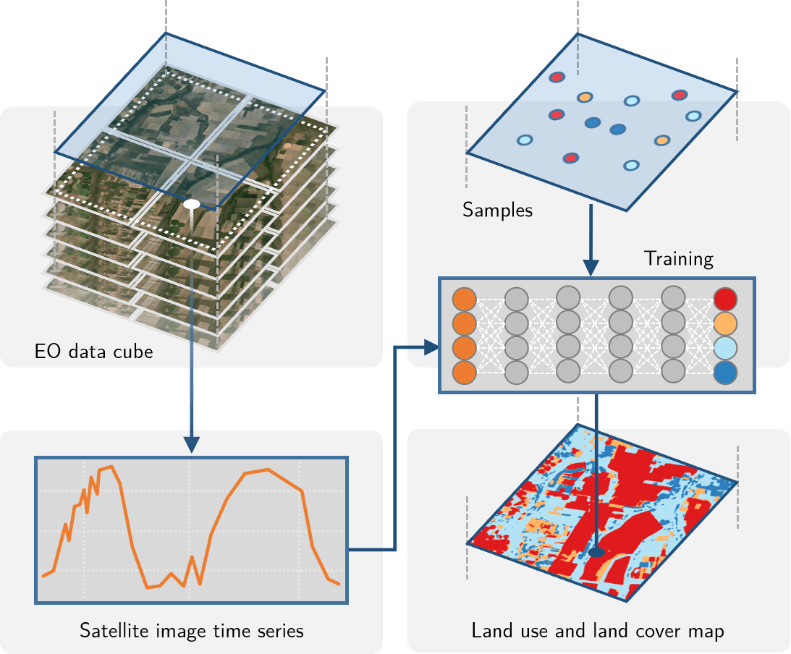
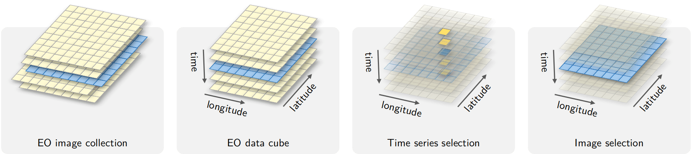
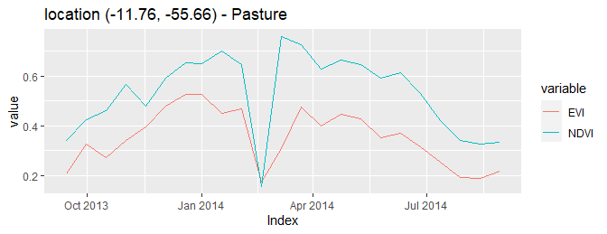
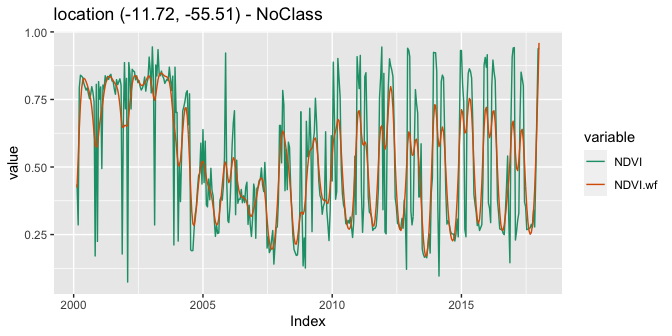
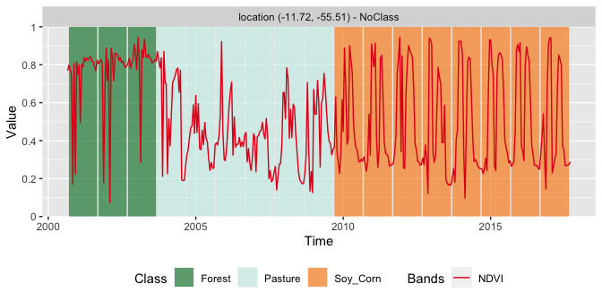
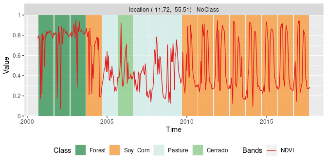

SITS - Satellite Image Time Series Analysis for Earth Observation Data
Cubes
================

<!-- README.md is generated from README.Rmd. Please edit that file -->


<!-- badges: start -->
<!-- [](https://drone.dpi.inpe.br/e-sensing/sits) -->

[](https://cloud.drone.io/e-sensing/sits)
[](https://codecov.io/gh/e-sensing/sits)
[](https://e-sensing.github.io/sitsbook/)
[](https://www.tidyverse.org/lifecycle/#maturing)
[](https://github.com/e-sensing/sits/blob/master/LICENSE)

<!-- badges: end -->

## Overview

The `sits` R package provides a set of tools for analysis, visualization
and classification of satellite image time series. The package supports
classification of image data cubes using machine learning methods. The
basic workflow in SITS is:

1.  Create a data cube using image collections available in the cloud or
    in local machines.
2.  Extract time series from the data cube which are used as training
    data.
3.  Perform quality control and filtering on the samples.
4.  Train a machine learning model using the extracted samples.
5.  Classify the data cube using the trained model.
6.  Post-process the classified images.
7.  Evaluate the accuracy of the classification using best practices.

<div class="figure" style="text-align: center">


<p class="caption">
Conceptual view of data cubes (source: authors)
</p>

</div>

## SITS on Kaggle

Those that want to evaluate the `sits` package before installing are
invited to run the examples available on
[Kaggle](https://www.kaggle.com/esensing/code). These examples provide a
fast-track introduction to the package. We recommend running them in the
following order:

1.  [Introduction to
    SITS](https://www.kaggle.com/esensing/introduction-to-sits)
2.  [Working with time series in
    SITS](https://www.kaggle.com/esensing/working-with-time-series-in-sits)
3.  [Creating data cubes in
    SITS](https://www.kaggle.com/esensing/creating-data-cubes-in-sits)
4.  [Raster classification in
    SITS](https://www.kaggle.com/esensing/raster-classification-in-sits)
5.  [Using SOM for sample quality control in
    SITS](https://www.kaggle.com/esensing/using-som-for-sample-quality-control-in-sits)

## Installation

### Pre-Requisites

The `sits` package relies on `sf`, `terra` and `raster`, which in turn,
require the installation of the GDAL and PROJ libraries. Please follow
the instructions for installing `sf` together with GDAL available at the
[RSpatial sf github repository](https://github.com/r-spatial/sf).

### Obtaining SITS

SITS is currently available on github:

``` r
# Please install the `sits` package from github
# and its dependencies
devtools::install_github("e-sensing/sits", dependencies = TRUE)
```

``` r
# load the sits library
library(sits)
#> Using configuration file: C:/Users/rolf/Softwares/R-4.1.1/library/sits/extdata/config.yml
#> Color configurations found in C:/Users/rolf/Softwares/R-4.1.1/library/sits/extdata/config_colors.yml
#> To provide additional configurations, create an YAML file and inform its path to environment variable 'SITS_CONFIG_USER_FILE'.
#> Using raster package: terra
#> SITS - satellite image time series analysis.
#> Loaded sits v0.16.0.
#>         See ?sits for help, citation("sits") for use in publication.
#>         See demo(package = "sits") for examples.
```

## Building Earth Observation Data Cubes

### Image Collections Accessible by SITS

The `sits` R package allows advanced data analysis on big EO data cubes
available in cloud computing services. *Data cubes* are collections of
remote sensing images that have been organized to have spatial cells of
the same size, covering a regular area in space and time. These data
cubes are built from analysis-ready image collections available in the
cloud.

<div class="figure" style="text-align: center">


<p class="caption">
Conceptual view of data cubes (source: authors)
</p>

</div>

The image collections accessible in `sits` version 0.15.1 to build EO
data cubes are:

1.  AWS: Sentinel-2/2A level 2A collections, including
    “SENTINEL-S2-L2A-COGS” (open data) and “SENTINEL-S2-L2A” (non open
    data).
2.  Brazil Data Cube (BDC): Open data collections of Sentinel-2,
    Landsat-8 and CBERS-4 images.
3.  Digital Earth Africa (DEAFRICA): Open data collection of
    Sentinel-2/2A and Landsat-8 for Africa.
4.  Microsoft Planetary Computer (MSPC): Open data collection of
    Sentinel-2/2A and Landsat-8.
5.  USGS: Landsat-4/5/7/8 collections, which are not open data.

Open data collections do not require payment of access fees to cloud
providers. Except for those in the Brazil Data Cube, these collections
are not regular. Irregular collections require further processing before
they can be used in `sits` for classification using machine learning
methods.

### Building an EO Data Cube from an ARD Image Collection

The following code defines an irregular data cube of Sentinel-2/2A
images using AWS, using the open data collection “sentinel-s2-l2a-cogs”.
The geographical area of the data cube is defined by the tiles “20LKP”
and “20LLKP”, and the temporal extent by a start and end date. Access to
other cloud services works in similar ways.

``` r
s2_cube <- sits_cube(source = "AWS",
                     collection = "sentinel-s2-l2a-cogs",
                     tiles = c("20LKP", "20LLP"),
                     bands = c("B03", "B04", "B08", "B8A", "B11", "SCL"),
                     start_date = as.Date("2018-07-01"),
                     end_date = as.Date("2019-06-30")
)
```

The cube can be shown in a leaflet using `sits_view()`.

``` r
# View a color composite on a leaflet
sits_view(s2_cube, green = "B08", blue = "B03", red = "B04")
```

This cube is irregular. The timelines of tiles “20LKP” and “20LLKP” and
the resolutions of the bands are different. Sentinel-2 bands “B03”,
“B04”, and “B08” have 10 m resolution, while bands “B8A”, “B11” and the
cloud band “SCL” have 20 m resolution. Irregular collections need an
additional processing step to be converted to regular data cubes, as
described below.

After defining an irregular ARD image collection from a cloud service
using `sits_cube()`, users should run `sits_regularize()` to build a
regular data cube. This function uses the [gdalcubes R
package](https://github.com/appelmar/gdalcubes), described in [Appel and
Pebesma, 2019](https://www.mdpi.com/2306-5729/4/3/92).

``` r
gc_cube <- sits_regularize(cube          = s2_cube,
                           output_dir    = tempdir(),
                           period        = "P15D",
                           agg_method    = "median",
                           res           = 10, 
                           multicores    = 2)
```

The above command builds a regular data cube with all bands interpolated
to 10 meter spatial resolution and 15 days temporal resolution. Regular
data cubes are the input to the `sits` functions for time series
retrieval, building machine learning models, and classification of
raster images and time series.

## Working with Time Series in SITS

### Accessing Time Series in Data Cubes

SITS has been designed to use satellite image time series to derive
machine learning models. After the data cube has been created, time
series can be retrieved individually or by using CSV or SHP files, as in
the following example. The example below uses a data cube in a local
directory, whose images have been obtained from the “MOD13Q1-6”
collection of the Brazil Data Cube.

``` r
library(sits)
# this data cube uses images from the Brazil Data Cube that have 
# downloaded to a local directory
data_dir <- system.file("extdata/raster/mod13q1", package = "sits")
# create a cube from downloaded files
raster_cube <- sits_cube(
    source = "BDC",
    collection = "MOD13Q1-6",
    data_dir = data_dir,
    delim = "_",
    parse_info = c("X1", "X2", "tile", "band", "date")
)
#>   |                                                          |                                                  |   0%  |                                                          |==                                                |   4%  |                                                          |====                                              |   9%  |                                                          |=======                                           |  13%  |                                                          |=========                                         |  17%  |                                                          |===========                                       |  22%  |                                                          |=============                                     |  26%  |                                                          |===============                                   |  30%  |                                                          |=================                                 |  35%  |                                                          |====================                              |  39%  |                                                          |======================                            |  43%  |                                                          |========================                          |  48%  |                                                          |==========================                        |  52%  |                                                          |============================                      |  57%  |                                                          |==============================                    |  61%  |                                                          |=================================                 |  65%  |                                                          |===================================               |  70%  |                                                          |=====================================             |  74%  |                                                          |=======================================           |  78%  |                                                          |=========================================         |  83%  |                                                          |===========================================       |  87%  |                                                          |==============================================    |  91%  |                                                          |================================================  |  96%  |                                                          |==================================================| 100%
# obtain a set of samples defined by a CSV file
csv_file <- system.file("extdata/samples/samples_sinop_crop.csv",
                        package = "sits")
# retrieve the time series associated with the samples from the data cube
points <- sits_get_data(raster_cube, file = csv_file)
#> All points have been retrieved
# show the time series
points[1:3,]
#> # A tibble: 3 x 7
#>   longitude latitude start_date end_date   label   cube      time_series      
#>       <dbl>    <dbl> <date>     <date>     <chr>   <chr>     <list>           
#> 1     -55.7    -11.8 2013-09-14 2014-08-29 Pasture MOD13Q1-6 <tibble [23 x 3]>
#> 2     -55.6    -11.8 2013-09-14 2014-08-29 Pasture MOD13Q1-6 <tibble [23 x 3]>
#> 3     -55.7    -11.8 2013-09-14 2014-08-29 Forest  MOD13Q1-6 <tibble [23 x 3]>
```

After a time series has been obtained, it is loaded in a tibble. The
first six columns contain the metadata: spatial and temporal location,
label assigned to the sample, and coverage from where the data has been
extracted. The spatial location is given in longitude and latitude
coordinates. The first sample has been labelled “Pasture”, at location
(-55.65931, -11.76267), and is considered valid for the period
(2013-09-14, 2014-08-29). To display the time series, use the `plot()`
function.

``` r
plot(points[1,])
```

<div class="figure" style="text-align: center">


<p class="caption">
Plot of point at location (-55.65931, -11.76267) labelled as Pasture
</p>

</div>

For a large number of samples, where the amount of individual plots
would be substantial, the default visualization combines all samples
together in a single temporal interval.

``` r
# select the "ndvi" band
samples_ndvi <- sits_select(samples_modis_4bands, "NDVI")
# select only the samples with the cerrado label
samples_cerrado <- dplyr::filter(samples_ndvi, 
                  label == "Cerrado")
plot(samples_cerrado)
```

<div class="figure" style="text-align: center">


<p class="caption">
Samples for NDVI band for Cerrado class
</p>

</div>

## Time Series Clustering and Filtering

### Clustering for sample quality control

Clustering methods in SITS improve the quality of the samples and to
remove those that might have been wrongly labeled or that have low
discriminatory power. Good samples lead to good classification maps.
`sits` provides support for sample quality control using Self-organizing
Maps (SOM). The process of clustering with SOM is done by
`sits_som_map()`, which creates a self-organizing map and assesses the
quality of the samples.

``` r
# load the kohonen library
library(kohonen)
# create a SOM map from the samples
som_map <- sits_som_map(samples_modis_4bands,
                        grid_xdim = 6,
                        grid_ydim = 6)
# plot the map
plot(som_map)
```


This function uses the [“kohonen” R
package](https://www.jstatsoft.org/article/view/v087i07) to compute a
SOM grid. Each sample is assigned to a neuron, and neurons are placed in
the grid based on similarity. Each neuron will be associated with a
discrete probability distribution. Homogeneous neurons (those with a
single class) are assumed to be composed of good quality samples.
Heterogeneous neurons (those with two or more classes with significant
probability) are likely to contain noisy samples. Noisy samples can then
be identified and removed from the sample set using
`sits_som_clean_samples()`.

``` r
# create a new sample set removing noisy points
new_samples <- sits_som_clean_samples(som_map)
```

### Filtering

Satellite image time series are contaminated by atmospheric influence
and directional effects. To make the best use of available satellite
data archives, methods for satellite image time series analysis need to
deal with data sets that are *noisy* and *non-homogeneous*. For data
filtering, `sits` supports Savitzky–Golay (`sits_sgolay()`) and
Whittaker (`sits_whittaker()`) filters. As an example, we show how to
apply the Whittaker smoother to a 16-year NDVI time series.

``` r
# apply Whitaker filter to a time series sample for the NDVI band from 2000 to 2016
# merge with the original data
# plot the original and the modified series
point_ndvi <- sits_select(point_mt_6bands, bands = "NDVI")
point_ndvi %>% 
    sits_filter(sits_whittaker(lambda = 10)) %>% 
    sits_merge(point_ndvi) %>% 
    plot()
```

<div class="figure" style="text-align: center">


<p class="caption">
Whittaker filter of NDVI time series
</p>

</div>

## Time Series Classification

### Training Machine Learning Models

SITS provides support for the classification of both individual time
series as well as data cubes. The following machine learning methods are
available in SITS:

-   Multinomial logit and its variants ‘lasso’ and ‘ridge’
    (`sits_mlr()`)
-   Support vector machines (`sits_svm()`)
-   Random forests (`sits_rfor()`)
-   Extreme gradient boosting (`sits_xgboost()`)
-   Deep learning (DL) using multi-layer perceptrons (`sits_mlp()`)
-   DL using Deep Residual Networks (`sits_ResNet`) (see reference
    \[7\])
-   DL combining 1D convolution neural networks and multi-layer
    perceptrons (`sits_TempCNN()`) (See reference \[8\])

The following example illustrate how to train a dataset and classify an
individual time series. First we use the `sits_train()` function with
two parameters: the training dataset (described above) and the chosen
machine learning model (in this case, TempCNN). The trained model is
then used to classify a time series from Mato Grosso Brazilian state,
using `sits_classify()`. The results can be shown in text format using
the function `sits_show_prediction()` or graphically using `plot`.

``` r
# training data set
data("samples_modis_4bands")
# point to be classified
data("point_mt_6bands")
# Select the NDVI and EVI bands 
# Filter the band to reduce noise
# Train a deep learning model
tempCNN_model <- samples_modis_4bands %>% 
    sits_select(bands = c("NDVI", "EVI")) %>% 
    sits_train(ml_method = sits_TempCNN(verbose = FALSE)) 
# Select NDVI and EVI bands of the  point to be classified
# Filter the point 
# Classify using TempCNN model
# Plot the result
point_mt_6bands %>% 
  sits_select(bands = c("ndvi", "evi")) %>% 
  sits_classify(tempCNN_model) %>% 
  plot()
```



The following example shows how to classify a data cube organised as a
set of raster images. The result can also be visualised interactively
using `sits_view()`.

``` r
# Create a data cube to be classified
# Cube is composed of MOD13Q1 images from the Sinop region in Mato Grosso (Brazil)
data_dir <- system.file("extdata/raster/mod13q1", package = "sits")
sinop <- sits_cube(
    source = "BDC",
    collection = "MOD13Q1-6",
    data_dir = data_dir,
    delim = "_",
    parse_info = c("X1", "X2", "tile", "band", "date")
)
#>   |                                                          |                                                  |   0%  |                                                          |==                                                |   4%  |                                                          |====                                              |   9%  |                                                          |=======                                           |  13%  |                                                          |=========                                         |  17%  |                                                          |===========                                       |  22%  |                                                          |=============                                     |  26%  |                                                          |===============                                   |  30%  |                                                          |=================                                 |  35%  |                                                          |====================                              |  39%  |                                                          |======================                            |  43%  |                                                          |========================                          |  48%  |                                                          |==========================                        |  52%  |                                                          |============================                      |  57%  |                                                          |==============================                    |  61%  |                                                          |=================================                 |  65%  |                                                          |===================================               |  70%  |                                                          |=====================================             |  74%  |                                                          |=======================================           |  78%  |                                                          |=========================================         |  83%  |                                                          |===========================================       |  87%  |                                                          |==============================================    |  91%  |                                                          |================================================  |  96%  |                                                          |==================================================| 100%
# Classify the raster cube, generating a probability file
# Filter the pixels in the cube to remove noise
probs_cube <- sits_classify(sinop, 
                            ml_model = tempCNN_model
)
# apply a bayesian smoothing to remove outliers
bayes_cube <- sits_smooth(probs_cube)
# generate a thematic map
label_cube <- sits_label_classification(bayes_cube)
# plot the the labelled cube
plot(label_cube, title = "Land use and Land cover in Sinop, MT, Brazil in 2018")
```



## Additional information

For more information, please see the on-line book [“SITS: Data analysis
and machine learning for data cubes using satellite image
timeseries”](https://e-sensing.github.io/sitsbook/).

### References

#### Reference paper for sits

If you use `sits`, please cite the following paper:

-   \[1\] Rolf Simoes, Gilberto Camara, Gilberto Queiroz, Felipe Souza,
    Pedro R. Andrade, Lorena Santos, Alexandre Carvalho, and Karine
    Ferreira. “Satellite Image Time Series Analysis for Big Earth
    Observation Data”. Remote Sensing, 13, p. 2428, 2021.
    <https://doi.org/10.3390/rs13132428>.

Additionally, the sample quality control methods that use self-organised
maps are described in the following reference:

-   \[2\] Lorena Santos, Karine Ferreira, Gilberto Camara, Michelle
    Picoli, Rolf Simoes, “Quality control and class noise reduction of
    satellite image time series”. ISPRS Journal of Photogrammetry and
    Remote Sensing, vol. 177, pp 75-88, 2021.
    <https://doi.org/10.1016/j.isprsjprs.2021.04.014>.

#### Papers that use sits to produce LUCC maps

-   \[3\] Rolf Simoes, Michelle Picoli, et al., “Land use and cover maps
    for Mato Grosso State in Brazil from 2001 to 2017”. Sci Data 7, 34
    (2020).

-   \[4\] Michelle Picoli, Gilberto Camara, et al., “Big Earth
    Observation Time Series Analysis for Monitoring Brazilian
    Agriculture”. ISPRS Journal of Photogrammetry and Remote
    Sensing, 2018. DOI: 10.1016/j.isprsjprs.2018.08.007

-   \[5\] Karine Ferreira, Gilberto Queiroz et al., Earth Observation
    Data Cubes for Brazil: Requirements, Methodology and Products.
    Remote Sens. 2020, 12, 4033.

#### Papers that describe software used in sits

We thank the authors of these papers for making their code available to
be used in connection with sits.

-   \[6\] Appel, Marius, and Edzer Pebesma, “On-Demand Processing of
    Data Cubes from Satellite Image Collections with the Gdalcubes
    Library.” Data 4 (3): 1–16, 2020.

-   \[7\] Hassan Fawaz, Germain Forestier, Jonathan Weber, Lhassane
    Idoumghar, and Pierre-Alain Muller, “Deep learning for time series
    classification: a review”. Data Mining and Knowledge Discovery,
    33(4): 917–963, 2019.

-   \[8\] Pelletier, Charlotte, Geoffrey I. Webb, and Francois
    Petitjean. “Temporal Convolutional Neural Network for the
    Classification of Satellite Image Time Series.” Remote Sensing 11
    (5), 2019.

-   \[9\] Wehrens, Ron and Kruisselbrink, Johannes. “Flexible
    Self-Organising Maps in kohonen 3.0”. Journal of Statistical
    Software, 87, 7 (2018).

#### R packages used in sits

The authors are thankful for the contributions of Marius Appel, Tim
Appelhans, Henrik Bengtsson, Robert Hijmans, Edzer Pebesma, and Ron
Wehrens, respectively chief developers of the packages `gdalcubes`,
`leafem`, `data.table`, `terra/raster`, `sf`/`stars`, and `kohonen`. The
`sits` package is also much indebted to the work of the RStudio team,
including the `tidyverse` and the `keras` packages. We thank Charlotte
Pelletier and Hassan Fawaz for sharing the python code that has been
reused for the TempCNN and ResNet machine learning models. We recognise
the importance of the work by Chris Holmes and Mattias Mohr on the STAC
specification and API.

## Acknowledgements and Financial Support

This research was supported by the Amazon Fund through the financial
collaboration of the Brazilian Development Bank (BNDES) and the
Foundation for Science, Technology and Space Applications (FUNCATE),
process 17.2.0536.1. We also acknowledge support from Coordenação de
Aperfeiçoamento de Pessoal de Nível Superior-Brasil (CAPES) and from the
Conselho Nacional de Desenvolvimento Científico e Tecnológico (CNPq).
Additional funding was provided by the São Paulo State Foundation
(FAPESP) under eScience Program grant 2014/08398-6. This work is also
supported by the International Climate Initiative of the Germany Federal
Ministry for the Environment, Nature Conservation, Building and Nuclear
Safety (IKI) under grant 17-III-084- Global-A-RESTORE+ (“RESTORE+:
Addressing Landscape Restoration on Degraded Land in Indonesia and
Brazil”).

## How to contribute

The SITS project is released with a [Contributor Code of
Conduct](https://github.com/e-sensing/sits/blob/master/CODE_OF_CONDUCT.md).
By contributing to this project, you agree to abide by its terms.
