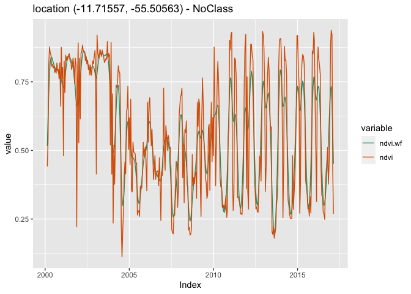
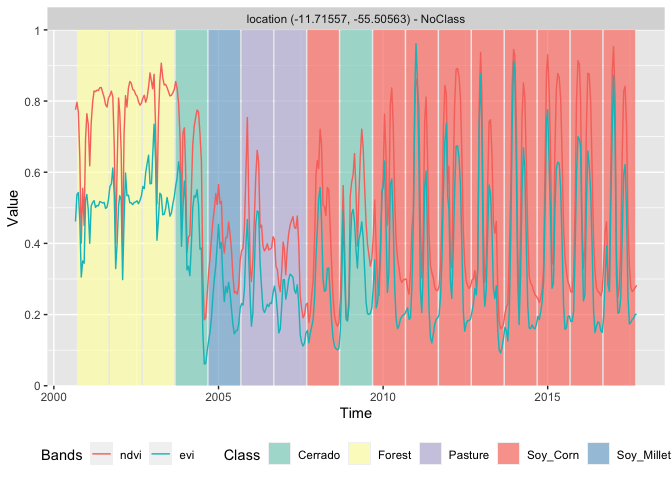

SITS - Satellite Image Time Series Analysis for Earth Observation Data
Cubes
================

### Overview

The `sits` R package provides a set of tools for analysis, visualization
and classification of satellite image time series. It includes methods
for filtering, clustering, classification, and post-processing.

## Installation

### Pre-Requisites

The `sits` package relies on `sf` and `rgdal`, which in turn, require
the installation of GDAL and PROJ library. Please follow the instruction
for installing `sf` and `rgdal` available at the [RSpatial sf github
repository](https://github.com/r-spatial/sf).

### Required Packages

Please follow the following steps.

``` r
# Install devtools, rmarkdown, knitr, testthat and Rcpp if not already available
install.packages(c("devtools", "rmarkdown", "Rcpp", "knitr", "testthat"))

# Please install the Suggested packages that are used by sits
install.packages(c("DBI","dendextend", "dtwclust","dtwSat", "e1071", "flexclust",
                   "imager", "imputeTS", "kohonen", "lwgeom", "MASS", "methods",
                   "mgcv", "nnet", "proto", "proxy", "ptw", "ranger", "RCurl",
                   "RSQLite", "signal", "xgboost", "zoo"))

# Please install the Keras package from the RStudio repository
devtools::install_github("rstudio/reticulate")
devtools::install_github("rstudio/keras")
# Build the keras environment
library(keras)
keras::install_keras()
# Retrieve the "wtss" package (used for data access to the WTSS service)
devtools::install_github("e-sensing/wtss")
library(wtss)
# Please install the `sits` package from github
devtools::install_github("e-sensing/sits")
library(sits)
# Retrieve the data available in the "inSitu" package (used for some examples)
devtools::install_github("e-sensing/inSitu")
library(inSitu)
```

### AMI Image

For users that have an AWS account, we have prepared a set of AMI
(Amazon Machine Images that is optimized for running SITS in the Amazon
Elastic Compute Cloud (or EC2). The AMI has the following settings: SITS
0.9.6, Ubuntu 18.04, R 4.0.2, and Rstudio Server 1.3.959. All packages
have been updated as of 21 August 2020. The AMI is avaliable for the
following regions:

  - [South America
    (sa-east-1)](https://console.aws.amazon.com/ec2/home?region=sa-east-1#launchAmi=ami-0567d9e8bca925a8d)
  - [Frankfurt(eu-central-1)](https://console.aws.amazon.com/ec2/home?region=eu-central-1#launchAmi=ami-088e0eb8b0c3a74e3)
  - [US East
    (us-east-1)](https://console.aws.amazon.com/ec2/home?region=us-east-1#launchAmi=ami-02aa6bc45d45f75b9)
  - [Asia Pacific
    Singapore(ap-southeast-1)](https://console.aws.amazon.com/ec2/home?region=ap-southeast-1#launchAmi=ami-025e0b3b65bedb145)

When you create an EC2 instance based on this AMI, ensure that your
‘security group’ settings allow incoming HTTP (port 80), HTTPS (port
443) and SSH (port 20) traffic. After the EC2 instance is started, then
copy-and-paste the ‘IPv4 Public IP’ address for your running instance to
a web browser address bar. That should bring the RStudio server
interface in your browser. Use “rstudio” as username and “e-sensing” as
password.

### Data Access

SITS has been designed to work with big satellite image data sets
organised data cubes. Data cubes can be available in the cloud or in a
local machine. Methods of data input for time series samples include (a)
obtain data from a time series web services such as INPE’s WTSS (Web
Series Time Service) or EMBRAPA’s SATVEG; (b) read data stored in a time
series in the ZOO format \[@Zeileis2005\]; (c) Read a time series from a
`raster bricks`. Currently, raster classification requires that data
cubes are organised as a `raster bricks` which can reside on a local or
remote service.

For more details on data access, please see the vignette [“Accessing
time series information in
SITS”](https://github.com/e-sensing/sits-docs/blob/master/doc/timeseries.pdf).

### Visualization

    #> Created logger for sits package - DEBUG level at /var/folders/21/g8ty6rhs2b350tzkmknqgwv00000gn/T//RtmpUDYgkk/sits_debug73375ab06965.log
    #> Created logger for sits package - ERROR level at /var/folders/21/g8ty6rhs2b350tzkmknqgwv00000gn/T//RtmpUDYgkk/sits_error733773d79466.log
    #> sits - satellite image time series analysis.
    #> Loaded sits v0.9.6.
    #>         See ?sits for help, citation("sits") for use in publication.
    #>         See demo(package = "sits") for examples.

``` r
cerrado_2classes[1:3,]
#> # A tibble: 3 x 7
#>   longitude latitude start_date end_date   label   cube    time_series      
#>       <dbl>    <dbl> <date>     <date>     <chr>   <chr>   <list>           
#> 1     -54.2    -14.0 2000-09-13 2001-08-29 Cerrado MOD13Q1 <tibble [23 × 3]>
#> 2     -54.2    -14.0 2001-09-14 2002-08-29 Cerrado MOD13Q1 <tibble [23 × 3]>
#> 3     -54.2    -14.0 2002-09-14 2003-08-29 Cerrado MOD13Q1 <tibble [23 × 3]>
```

After a time series is imported, it is loaded in a tibble. The first six
columns contain the metadata: spatial and temporal location, label
assigned to the sample, and coverage from where the data has been
extracted. The spatial location is given in longitude and latitude
coordinates for the “WGS84” ellipsoid. For example, the first sample has
been labelled “Pasture”, at location (-55.1852, -10.8387), and is
considered valid for the period (2013-09-14, 2014-08-29). To display the
time series, use the `plot()` function. For a large number of samples,
where the amount of individual plots would be substantial, the default
visualisation combines all samples together in a single temporal
interval.

``` r
# select the "ndvi" band
samples_ndvi <- sits_select_bands(samples_mt_4bands, ndvi)
# select only the samples with the cerrado label
samples_cerrado <- dplyr::filter(samples_ndvi, 
                  label == "Cerrado")
plot(samples_cerrado)
```

<div class="figure" style="text-align: center">


<p class="caption">

Samples for NDVI band for Cerrado class

</p>

</div>

### Clustering

Clustering methods in SITS improve the quality of the samples and to
remove those that might have been wrongly labeled or that have low
discriminatory power. Good samples lead to good classification maps.
`sits` provides support for two clustering methods to test sample
quality: (a) Agglomerative Hierarchical Clustering (AHC); (b)
Self-organizing Maps (SOM). For more details, please see the vignette
[“Clustering of Satellite Image Time Series with
SITS”](https://github.com/e-sensing/sits-docs/blob/master/doc/clustering.pdf)

## Filtering

Satellite image time series are contaminated by atmospheric influence
and directional effects. To make the best use of available satellite
data archives, methods for satellite image time series analysis need to
deal with data sets that are *noisy* and *non-homogeneous*. For data
filtering, `sits` supports Savitzky–Golay (`sits_sgolay()`), Whittaker
(`sits_whittaker()`), envelope (`sits_envelope()`) and the “cloud
filter” (`sits_cloud_filter()`). As an example, we show how to apply
the Whitakker smoother to a 16-year NDVI time series. For more details,
please see the vignette [“Satellite Image Time Series Filtering with
SITS”](https://github.com/e-sensing/sits-docs/blob/master/vignettes/filtering.pdf)

``` r
# apply Whitaker filter to a time series sample for the NDVI band from 2000 to 2016
# merge with the original data
# plot the original and the modified series
point_whit <- sits_filter(point_ndvi, sits_whittaker(lambda = 10))
point_whit %>% 
  sits_merge(point_ndvi) %>% 
  plot()
```

<!-- -->

## Time Series classification using machine learning

SITS provides support for the classification of both individual time
series as well as data cubes. The following machine learning methods are
available in SITS:

  - Linear discriminant analysis (`sits_lda`)
  - Quadratic discriminant analysis (`sits_qda`)
  - Multinomial logit and its variants ‘lasso’ and ‘ridge’ (`sits_mlr`)
  - Support vector machines (`sits_svm`)
  - Random forests (`sits_rfor`)
  - Extreme gradient boosting (`sits_xgboost`)
  - Deep learning (DL) using multi-layer perceptrons
    (`sits_deeplearning`)
  - DL with 1D convolutional neural networks (`sits_FCN`)
  - DL combining 1D CNN and multi-layer perceptron networks
    (`sits_TempCNN`)
  - DL using 1D version of ResNet (`sits_ResNet`)
  - DL using a combination of long-short term memory (LSTM) and 1D CNN
    (`sits_LSTM_FCN`)

The following example illustrate how to train a dataset and classify an
individual time series. First we use the `sits_train` function with two
parameters: the training dataset (described above) and the chosen
machine learning model (in this case, a random forest classifier). The
trained model is then used to classify a time series from Mato Grosso
Brazilian state, using `sits_classify`. The results can be shown in text
format using the function `sits_show_prediction` or graphically using
`plot`.

``` r

# Train a machine learning model for the mato grosso dataset using Extreme Gradient Boosting
samples_mt_2bands <- sits_select_bands(samples_mt_4bands, ndvi, evi)
svm_model <- sits_train(data = samples_mt_2bands, 
                         ml_method = sits_svm())

# get a point to be classified with four bands
point_mt_2bands <- sits_select_bands(point_mt_6bands, ndvi, evi)

# filter the point with a Whittaker smoother
point_filtered <- sits_whittaker(point_mt_2bands, lambda = 0.2, bands_suffix = "") 

# Classify using random forest model and plot the result
class.tb <- sits_classify(point_filtered, svm_model)
# plot the results of the prediction
plot(class.tb, bands = c("ndvi", "evi"))
```

<!-- -->

The following example shows how to classify a data cube organised as a
set of raster bricks. First, we ned to build a model based on the the
same bands as the data cube.

``` r
# estimate a model only for bands "ndvi" and "evi"
samples_mt_2bands <- sits_select_bands(samples_mt_4bands, ndvi, evi)
rfor_model <- sits_train(samples_mt_2bands, ml_method = sits_rfor(num_trees = 300))
# Create a data cube from two raster bricks
evi_file <- system.file("extdata/Sinop", "Sinop_evi_2014.tif", package = "inSitu")
ndvi_file <- system.file("extdata/Sinop", "Sinop_ndvi_2014.tif", package = "inSitu")

# Obtain the associated timeline
time_file <- system.file("extdata/Sinop", "timeline_2014.txt", package = "inSitu")
timeline_2013_2014 <- scan(time_file, character(), quiet = TRUE)

# create a raster metadata file based on the information about the files
raster_cube <- sits_cube(type = "BRICK", name = "Sinop", 
                         satellite = "TERRA", sensor = "MODIS",
                         timeline = timeline_2013_2014, 
                         bands = c("ndvi", "evi"), 
                         files = c(ndvi_file, evi_file))
# Classify the raster cube, generating a probability file
probs_cube <- sits_classify(raster_cube, ml_model = rfor_model)

# label the probability file (by default selecting the class with higher probability)
# apply a bayesian smoothing to remove outliers
label_cube <- sits_label_classification(probs_cube, smoothing = "bayesian")

# plot the first raster object with a selected color pallete
# make a title, define the colors and the labels)
plot(label_cube, time = 1, title = "SINOP-MT - 2013/2014")
```

<div class="figure" style="text-align: center">


<p class="caption">

Image classified with XGBoost

</p>

</div>

### Additional information

For more information, please see the vignettes

  - [“SITS: Data analysis and machine learning for data cubes using
    satellite image time
    series”](https://github.com/e-sensing/sits-docs/blob/master/doc/sits.pdf)

  - [“Accessing time series information in
    SITS”](https://github.com/e-sensing/sits-docs/blob/master/doc/timeseries.pdf)

  - [“Clustering of satellite image time series with
    SITS”](https://github.com/e-sensing/sits-docs/blob/master/doc/clustering.pdf)

  - [“Satellite image time series filtering with
    SITS”](https://github.com/e-sensing/sits-docs/blob/master/doc/filters.pdf)

  - [“Time series classification using machine
    learning”](https://github.com/e-sensing/sits-docs/blob/master/doc/machinelearning.pdf)

  - [“Post classification smoothing using Bayesian techniques in
    SITS”](https://github.com/e-sensing/sits-docs/blob/master/doc/smoothing.pdf)

#### Package status of SITS

|                    | Status                                                                                                                                                                                      |
| ------------------ | ------------------------------------------------------------------------------------------------------------------------------------------------------------------------------------------- |
| Code Build         | [](http://www.dpi.inpe.br/jenkins/job/sits-build-ubuntu-16.04/lastBuild/consoleFull)                 |
| Code Check         | [](http://www.dpi.inpe.br/jenkins/job/sits-check-ubuntu-16.04/lastBuild/consoleFull)                 |
| Code Documentation | [](http://www.dpi.inpe.br/jenkins/job/sits-documentation-ubuntu-16.04/lastBuild/consoleFull) |
| Code Coverage      | [](http://www.dpi.inpe.br/jenkins/job/sits-covr-ubuntu-16.04/lastBuild/consoleFull)                   |
| Test Coverage      | [](https://codecov.io/github/e-sensing/sits?branch=master)                                     |
| Project Status     | [](https://www.tidyverse.org/lifecycle/#maturing)                                                                             |
| Lifecycle          | [](https://www.tidyverse.org/lifecycle/#maturing)                                                                       |

[](https://zenodo.org/badge/latestdoi/98539507)

#### License

The **sits** package is licensed under the GPLv3
(<http://www.gnu.org/licenses/gpl.html>).
