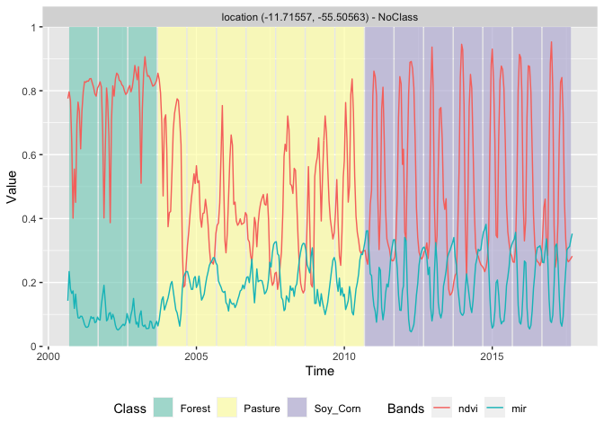

SITS - Satellite Image Time Series Analysis for Earth Observation Data
Cubes
================

<!-- README.md is generated from README.Rmd. Please edit that file -->


<!-- badges: start -->

[](https://drone.dpi.inpe.br/e-sensing/sits)
[](https://codecov.io/gh/e-sensing/sits)
[](https://github.com/e-sensing/sits-docs)
[](https://www.tidyverse.org/lifecycle/#maturing)
[](https://github.com/e-sensing/sits/blob/master/LICENSE)

<!-- badges: end -->

### Overview

The `sits` R package provides a set of tools for analysis, visualization
and classification of satellite image time series. The main aim of SITS
is to support land cover and land change classification of image data
cubes using machine learning methods. The basic workflow in SITS is:

1.  Create a data cube using image collections available in the cloud or
    in local machines.
2.  Extract time series from the data cube which are used as training
    data.
3.  Perform quality control and filtering on the samples.
4.  Train a machine learning model using the extracted samples.
5.  Classify the data cube using the trained model.
6.  Post-process the classified images.

## Installation

### Pre-Requisites

The `sits` package relies on `sf` and `rgdal`, which in turn, require
the installation of the GDAL and PROJ libraries. Please follow the
instructions for installing `sf` and `rgdal` available at the [RSpatial
sf github repository](https://github.com/r-spatial/sf).

### Obtaining SITS

SITS is currently available on github, as follows:

``` r
# Please install the `sits` package from github
devtools::install_github("e-sensing/sits")
library(sits)
```

### AMI Image

For users that have an AWS account, we have prepared a set of AMI
(Amazon Machine Images that are optimized for running SITS in the Amazon
Elastic Compute Cloud (or EC2). The AMI has the following settings: SITS
0.9.6, Ubuntu 18.04, R 4.0.2, and Rstudio Server 1.3.959. All packages
have been updated as of 21 August 2020. The AMI is avaliable for the
following regions:

-   [South America
    (sa-east-1)](https://console.aws.amazon.com/ec2/home?region=sa-east-1#launchAmi=ami-0567d9e8bca925a8d)
-   [Frankfurt(eu-central-1)](https://console.aws.amazon.com/ec2/home?region=eu-central-1#launchAmi=ami-088e0eb8b0c3a74e3)
-   [US East
    (us-east-1)](https://console.aws.amazon.com/ec2/home?region=us-east-1#launchAmi=ami-02aa6bc45d45f75b9)
-   [Asia Pacific
    Singapore(ap-southeast-1)](https://console.aws.amazon.com/ec2/home?region=ap-southeast-1#launchAmi=ami-025e0b3b65bedb145)

When you create an EC2 instance based on this AMI, ensure that your
‘security group’ settings allow incoming HTTP (port 80), HTTPS (port
443) and SSH (port 20) traffic. After the EC2 instance is started, then
copy-and-paste the ‘IPv4 Public IP’ address for your running instance to
a web browser address bar. That should bring the RStudio server
interface in your browser. Use “rstudio” as username and “e-sensing” as
password.

### Data Cubes

SITS has been designed to work with big satellite image data sets
organised as data cubes. Data cubes can be available in the cloud or in
a local machine. Currently, SITS supports data cubes available in the
following cloud services:

1.  Sentinel-2/2A level 2A images in AWS.
2.  Collections of Sentinel, Landsat and CBERS images in the Brazil Data
    Cube (BDC).
3.  Collections available in Digital Earth Africa.
4.  Data cubes produced by the “gdalcubes” package.
5.  Local image collections organized as RasterStacks of RasterBricks.

SITS relies on STAC services provided by these cloud services. The user
can define a data cube by selecting a collection in a cloud service and
then defining a space-time extent. For example, the following code will
define a data cube of Sentinel-2/2A images using AWS.

``` r
s2_cube <- sits_cube(
    type = "S2_L2A_AWS",
    name = "T20LKP_2018_2019",
    satellite = "SENTINEL-2",
    sensor = "MSI",
    tiles = "20LKP",
    s2_aws_resolution = "20m",
    start_date = as.Date("2018-07-18"),
    end_date = as.Date("2018-07-23")
)
```

In the above example, the user has selected the “Sentinel-2 Level 2”
collection in the AWS cloud services. The geographical area of the data
cube is defined by the tile “20LKP”, and the temporal extent by a start
and end date. Access to other cloud services works in similar ways.

Users can derive data cubes from ARD data which have pre-defined
temporal resolutions. For example, a user may want to define the best
Sentinel-2 pixel in a one month period, as shown below. This can be done
in SITS using the “gdalcubes” package. For details in gdalcubes, please
see <https://github.com/appelmar/gdalcubes>.

``` r
gc_cube <- sits_cube(type        = "GDALCUBES",
                     name        = "T20LKP_2018_2019_1M",
                     cube        = s2_cube,
                     path_db     = "/my/path/cube.db",
                     path_images = "/my/path/images/",
                     period      = "P1M",
                     agg_method  = "median",
                     resampling  = "bilinear")
```

### Data Access - Individual time series

SITS has been designed to use satellite image time series to derive
machine learning models. After the data cube has been created, time
series can be retreived individually or by using CSV or SHP files, as in
the following example.

``` r
library(sits)
#> SITS - satellite image time series analysis.
#> Loaded sits v0.10.0.
#>         See ?sits for help, citation("sits") for use in publication.
#>         See demo(package = "sits") for examples.
#> Using configuration file: /Users/gilbertocamara/Library/R/4.0/library/sits/extdata/config.yml
#> Users can provide additional configurations in ~/.sits/config.yml
# create a cube from a local file 
file <- c(system.file("extdata/raster/mod13q1/sinop-ndvi-2014.tif",
                      package = "sits"
))
raster_cube <- sits_cube(
  type = "BRICK",
  name = "Sinop-crop",
  satellite = "TERRA",
  sensor = "MODIS",
  timeline = sits::timeline_2013_2014,
  bands = c("ndvi"),
  files = file
)
# obtain a set of locations defined by a CSV file
csv_raster_file <- system.file("extdata/samples/samples_sinop_crop.csv",
                               package = "sits"
)
# retrieve the points from the data cube
points <- sits_get_data(raster_cube, file = csv_raster_file)
#> All points have been retrieved
# show the points
points
#> # A tibble: 12 x 7
#>    longitude latitude start_date end_date   label    cube       time_series     
#>        <dbl>    <dbl> <date>     <date>     <chr>    <chr>      <list>          
#>  1     -55.7    -11.8 2013-09-14 2014-08-29 Pasture  Sinop-crop <tibble [23 × 2…
#>  2     -55.6    -11.8 2013-09-14 2014-08-29 Pasture  Sinop-crop <tibble [23 × 2…
#>  3     -55.7    -11.8 2013-09-14 2014-08-29 Forest   Sinop-crop <tibble [23 × 2…
#>  4     -55.6    -11.8 2013-09-14 2014-08-29 Pasture  Sinop-crop <tibble [23 × 2…
#>  5     -55.7    -11.8 2013-09-14 2014-08-29 Forest   Sinop-crop <tibble [23 × 2…
#>  6     -55.6    -11.7 2013-09-14 2014-08-29 Forest   Sinop-crop <tibble [23 × 2…
#>  7     -55.7    -11.7 2013-09-14 2014-08-29 Soy_Corn Sinop-crop <tibble [23 × 2…
#>  8     -55.7    -11.7 2013-09-14 2014-08-29 Soy_Corn Sinop-crop <tibble [23 × 2…
#>  9     -55.7    -11.7 2013-09-14 2014-08-29 Soy_Corn Sinop-crop <tibble [23 × 2…
#> 10     -55.6    -11.8 2013-09-14 2014-08-29 Soy_Corn Sinop-crop <tibble [23 × 2…
#> 11     -55.6    -11.8 2013-09-14 2014-08-29 Soy_Corn Sinop-crop <tibble [23 × 2…
#> 12     -55.6    -11.8 2013-09-14 2014-08-29 Soy_Corn Sinop-crop <tibble [23 × 2…
```

After a time series is imported, it is loaded in a tibble. The first six
columns contain the metadata: spatial and temporal location, label
assigned to the sample, and coverage from where the data has been
extracted. The spatial location is given in longitude and latitude
coordinates. The first sample has been labelled “Pasture”, at location
(-55.65931, -11.76267), and is considered valid for the period
(2013-09-14, 2014-08-29). To display the time series, use the `plot()`
function.

``` r
plot(points[1,])
```

<!-- -->

For a large number of samples, where the amount of individual plots
would be substantial, the default visualisation combines all samples
together in a single temporal interval.

``` r
# select the "ndvi" band
samples_ndvi <- sits_select(samples_mt_4bands, "NDVI")
# select only the samples with the cerrado label
samples_cerrado <- dplyr::filter(samples_ndvi, 
                  label == "Cerrado")
plot(samples_cerrado)
```

<div class="figure" style="text-align: center">


<p class="caption">
Samples for NDVI band for Cerrado class
</p>

</div>

### Clustering

Clustering methods in SITS improve the quality of the samples and to
remove those that might have been wrongly labeled or that have low
discriminatory power. Good samples lead to good classification maps.
`sits` provides support for two clustering methods to test sample
quality: (a) Agglomerative Hierarchical Clustering (AHC); (b)
Self-organizing Maps (SOM). For more details, please see the vignette
[“Clustering of Satellite Image Time Series with
SITS”](https://github.com/e-sensing/sits-docs/blob/master/doc/clustering.pdf)

## Filtering

Satellite image time series are contaminated by atmospheric influence
and directional effects. To make the best use of available satellite
data archives, methods for satellite image time series analysis need to
deal with data sets that are *noisy* and *non-homogeneous*. For data
filtering, `sits` supports Savitzky–Golay (`sits_sgolay()`), Whittaker
(`sits_whittaker()`), envelope (`sits_envelope()`) and the “cloud
filter” (`sits_cloud_filter()`). As an example, we show how to apply the
Whitakker smoother to a 16-year NDVI time series. For more details,
please see the vignette [“Satellite Image Time Series Filtering with
SITS”](https://github.com/e-sensing/sits-docs/blob/master/doc/filters.pdf)

``` r
# apply Whitaker filter to a time series sample for the NDVI band from 2000 to 2016
# merge with the original data
# plot the original and the modified series
point_whit <- sits_filter(point_ndvi, sits_whittaker(lambda = 10))
point_whit %>% 
  sits_merge(point_ndvi) %>% 
  plot()
```

<div class="figure" style="text-align: center">


<p class="caption">
Whitaler filter of NDVI time series
</p>

</div>

## Time Series classification using machine learning

SITS provides support for the classification of both individual time
series as well as data cubes. The following machine learning methods are
available in SITS:

-   Linear discriminant analysis (`sits_lda`)
-   Quadratic discriminant analysis (`sits_qda`)
-   Multinomial logit and its variants ‘lasso’ and ‘ridge’ (`sits_mlr`)
-   Support vector machines (`sits_svm`)
-   Random forests (`sits_rfor`)
-   Extreme gradient boosting (`sits_xgboost`)
-   Deep learning (DL) using multi-layer perceptrons
    (`sits_deeplearning`)
-   DL with 1D convolutional neural networks (`sits_FCN`)
-   DL combining 1D CNN and multi-layer perceptron networks
    (`sits_TempCNN`)
-   DL using 1D version of ResNet (`sits_ResNet`)
-   DL using a combination of long-short term memory (LSTM) and 1D CNN
    (`sits_LSTM_FCN`)

The following example illustrate how to train a dataset and classify an
individual time series. First we use the `sits_train` function with two
parameters: the training dataset (described above) and the chosen
machine learning model (in this case, a random forest classifier). The
trained model is then used to classify a time series from Mato Grosso
Brazilian state, using `sits_classify`. The results can be shown in text
format using the function `sits_show_prediction` or graphically using
`plot`.

``` r
# Train a machine learning model for the mato grosso dataset using SVM
samples_mt_2bands <- sits_select(samples_mt_4bands, bands = c("ndvi", "evi"))
svm_model <- sits_train(data = samples_mt_2bands, 
                         ml_method = sits_svm())

# get a point to be classified with four bands
point_mt_2bands <- sits_select(point_mt_6bands, bands = c("ndvi", "evi"))

# filter the point with a Whittaker smoother
point_filtered <- sits_whittaker(point_mt_2bands, lambda = 0.2, bands_suffix = "") 

# Classify using random forest model and plot the result
class.tb <- sits_classify(point_filtered, svm_model)

# plot the results of the prediction
plot(class.tb, bands = c("ndvi", "evi"))
```

<div class="figure" style="text-align: center">


<p class="caption">
Time series classification using SVM
</p>

</div>

The following example shows how to classify a data cube organised as a
set of raster bricks. First, we need to build a model based on the the
same bands as the data cube.

``` r
# estimate a model only for bands "ndvi" and "evi"
samples_mt_2bands <- sits_select_bands(samples_mt_4bands, ndvi, evi)
rfor_model <- sits_train(samples_mt_2bands, ml_method = sits_rfor(num_trees = 300))
# Create a data cube from two raster bricks
evi_file <- system.file("extdata/Sinop", "Sinop_evi_2014.tif", package = "inSitu")
ndvi_file <- system.file("extdata/Sinop", "Sinop_ndvi_2014.tif", package = "inSitu")

# Obtain the associated timeline
time_file <- system.file("extdata/Sinop", "timeline_2014.txt", package = "inSitu")
timeline_2013_2014 <- scan(time_file, character(), quiet = TRUE)

# create a raster metadata file based on the information about the files
raster_cube <- sits_cube(type = "BRICK", name = "Sinop", 
                         satellite = "TERRA", sensor = "MODIS",
                         timeline = timeline_2013_2014, 
                         bands = c("ndvi", "evi"), 
                         files = c(ndvi_file, evi_file))
# Classify the raster cube, generating a probability file
probs_cube <- sits_classify(raster_cube, ml_model = rfor_model)

# label the probability file (by default selecting the class with higher probability)
# apply a bayesian smoothing to remove outliers
bayes_cube <- sits_smooth(probs_cube)

# generate thematic map
label_cube <- sits_label_classification(bayes_cube)

# plot the first raster object with a selected color palette
# make a title, define the colors and the labels)
plot(label_cube, time = 1, title = "SINOP-MT - 2013/2014")
```

<div class="figure" style="text-align: center">


<p class="caption">
Image classified with XGBoost
</p>

</div>

### Additional information

For more information, please see the vignettes

-   [“SITS: Data analysis and machine learning for data cubes using
    satellite image time
    series”](https://github.com/e-sensing/sits-docs/blob/master/doc/sits.pdf)

-   [“Accessing time series information in
    SITS”](https://github.com/e-sensing/sits-docs/blob/master/doc/timeseries.pdf)

-   [“Clustering of satellite image time series with
    SITS”](https://github.com/e-sensing/sits-docs/blob/master/doc/clustering.pdf)

-   [“Satellite image time series filtering with
    SITS”](https://github.com/e-sensing/sits-docs/blob/master/doc/filters.pdf)

-   [“Time series classification using machine
    learning”](https://github.com/e-sensing/sits-docs/blob/master/doc/machinelearning.pdf)

-   [“Post classification smoothing using Bayesian techniques in
    SITS”](https://github.com/e-sensing/sits-docs/blob/master/doc/smoothing.pdf)

## How to contribute

The SITS project is released with a [Contributor Code of
Conduct](https://github.com/e-sensing/sits/blob/master/CODE_OF_CONDUCT.md).
By contributing to this project, you agree to abide by its terms.
