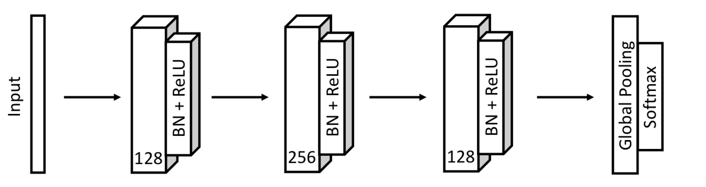
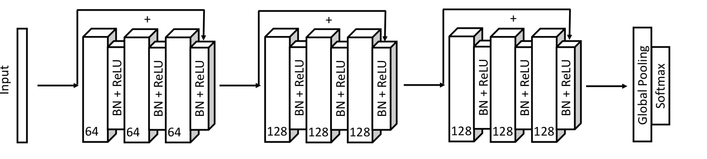
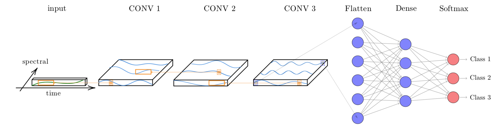

---
output:
    pdf_document:
      citation_package: natbib
      df_print: tibble
      fig_caption: yes
      keep_tex: no
      template: "../inst/extdata/markdown/latex-ms.tex"
title: 'Machine Learning for Data Cubes using the SITS package'
author:
- affiliation: National Institute for Space Research (INPE), Brazil
  name: Rolf Simoes
- affiliation: National Institute for Space Research (INPE), Brazil
  name: Gilberto Camara
- affiliation: Institute for Applied Economics Research (IPEA), Brazil
  name: Alexandre Carvalho
- affiliation: National Institute for Space Research (INPE), Brazil
  name: Pedro R. Andrade
- affiliation: University of Vienna
  name: Victor Maus

date: "`r format(Sys.time(), '%B %d, %Y')`"
endnote: false
fontfamily: mathdesign
fontfamilyoptions: adobe-utopia
fontsize: 11pt
graphics: true
mathtools: true
bibliography: ../inst/extdata/markdown/references-sits.bib
abstract: This vignette presents the machine learning techniques available in SITS. The main use for machine learning in SITS is for classification of land use and land cover. These machine learining methods avilable in SITS include linear and quadratic discrimination analysis, support vector machines, random forests, deep learning and neural networks.
vignette: |
  %\VignetteEncoding{UTF-8} 
  %\VignetteEngine{knitr::rmarkdown} 
  %\VignetteIndexEntry{Machine Learning for Data Cubes using the SITS package}
---
```{r, include = FALSE}
library(sits)
```
# Machine learning classification

`sits` has support for a variety of machine learning techniques: linear discriminant analysis, quadratic discriminant analysis, multinomial logistic regression, random forests, boosting, support vector machines, and deep learning. The deep learning methods include multi-layer perceptrons, 1D convolution neural networks and mixed approaches such as TempCNN [@Pelletier2019] . In a recent review of machine learning methods to classify remote sensing data [@Maxwell2018], the authors note that many factors influence the performance of these classifiers, including the size and quality of the training dataset, the dimension of the feature space, and the choice of the parameters. We support both \emph{space-first, time-later} and \emph{time-first, space-later} approaches. Therefore, the `sits` package provides functionality to explore the full depth of satellite image time series data. 

When used in \emph{time-first, space-later} approach, `sits` treats time series as a feature vector. To be consistent, the procedure aligns all time series from different years by its time proximity considering an given cropping schedule. Once aligned, the feature vector is formed by all pixel "bands". The idea is to have as many temporal attributes as possible, increasing the dimension of the classification space. In this scenario, statistical learning models are the natural candidates to deal with high-dimensional data: learning to distinguish all land cover and land use classes from trusted samples exemplars (the training data) to infer classes of a larger data set. 

# Data used in the machine learning examples

For the machine learning examples, we use a data set containing a sits tibble with time series samples from Brazilian Mato Grosso State (Amazon and Cerrado biomes). The samples are from many sources. It has 9 classes ("Cerrado", "Fallow_Cotton", "Forest", "Millet_Cotton", "Pasture", "Soy_Corn", "Soy_Cotton", "Soy_Fallow", "Soy_Millet"). Each time series comprehends 12 months (23 data points) from MOD13Q1 product, and has 6 bands ("ndvi", "evi", "blue", "red", "nir", "mir". The dataset was used in the paper "Big Earth observation time series analysis for monitoring Brazilian agriculture" [@Picoli2018], and is available in the R package "inSitu", which is downloadable from the website associated to the "e-sensing" project. The examples below use two out of six bands ("ndvi", "evi") for training and classification. In practice, we suggest that users include additionally at least the "nir" and "mir" bands.

```{r, include = FALSE}
# Retrieve the set of samples for the Mato Grosso region (provided by EMBRAPA)
#select the bands for classification
if (!requireNamespace("inSitu", quietly = TRUE)) {
    if (!requireNamespace("devtools", quietly = TRUE))
        install.packages("devtools")
    devtools::install_github("e-sensing/inSitu")
}
library(inSitu)

#select the data for classification
mato_grosso_samples <- inSitu::br_mt_1_8K_9classes_6bands
mato_grosso_2bands  <- sits_select_bands(mato_grosso_samples, ndvi, evi)

# get a point to be classified
point_mt_2bands <- sits_select_bands(point_mt_6bands, ndvi, evi)
```

# Visualizing Samples 

One useful way of describing and understanding the samples is by plotting them. A direct way of doing so is using the `sits_plot` function. When applied to a large data sample, the result is the set of all samples for each label and each band, as shown in the example below, where we plot the raw distribution of the "Forest", "Pasture" and "Cerrado" labels in the "evi" band.

```{r, include = FALSE}
# Select a subset of the samples to be plotted
mato_grosso_2bands %>% 
    sits_select_bands(ndvi) %>% 
    dplyr::filter(label %in% c("Forest", "Cerrado", "Pasture")) %>% 
    sits_plot()
```
In the above plots, the thick red line is the median value for each time instance and the yellow lines are the first and third interquartile ranges. Visually, one can see that samples labelled as "Forest" are distinguishable from those of "Cerrado" and "Pasture"; in turn, these latter classes have many similar features and required sophisticated methods for distinction.

An alternative to visualise the samples is to estimate a statistical approximation to an idealized pattern based on a generalised additive model (GAM). A GAM is a linear model in which the linear predictor depends linearly on a smooth function of the predictor variables
$$
y = \beta_{i} + f(x) + \epsilon, \epsilon \sim N(0, \sigma^2).
$$
The function `sits_patterns` uses a GAM to predict a smooth, idealized approximation to the time series associated to the each label, for all bands. This function is based on the R package `dtwSat`[@Maus2019], which implements the TWDTW time series matching method described in @Maus2016. The resulting patterns can be viewed using `sits_plot`. 
```{r, include = FALSE, fig.align="center", fig.cap="Patterns for the Mato Grosso 2 band data set"}
# Select a subset of the samples to be plotted
mato_grosso_2bands %>% 
    sits_patterns() %>% 
    sits_plot()
```
The resulting plots provide some insights over the time series behaviour of each class. While the response of the "Forest" class is quite distinctive, there are similarities between the double-cropping classes ("Soy-Corn", "Soy-Millet", "Soy-Sunflower" and "Soy-Corn") and between the "Cerrado" and "Pasture" classes. This could suggest that additional information, more bands, or higher-resolution data could be considered to provide a better basis for time series samples that can better distinguish the intended classes. Despite these limitations, the best machine learning algorithms can provide good performance even in the above case.

# Common interface to machine learning and deeplearning models 

The SITS package provides a common interface to all machine learning models, using the `sits_train` function. this function takes two parameters: the input data samples and the ML method (`ml_method`), as shown below. After the model is estimated, it can be used to classify individual time series or full data cubes using the `sits_classify` function. In the examples that follow, we show how to apply each method for the classification of a single time series. Then, we disscuss how to classify full data cubes. 

When a dataset of time series organised as a SITS tibble is taken as input to the classifier,  the result is the same tibble with one additional column ("predicted"), which contains the information on what labels are have been assigned for each interval. The following examples illustrate how to train a dataset and classify an individual time series using the different machine learning techniques. First we use the `sits_train` function with two parameters: the training dataset (described above) and the chosen machine learning model (in this case, a random forest classifier). The trained model is then used to classify a time series from Mato Grosso Brazilian state, using `sits_classify`. The results can be shown in text format using the function `sits_show_prediction` or graphically using `sits_plot`.  

# Random forests

The Random forest uses the idea of *decision trees* as its base model. It combines many decision trees via *bootstrap* procedure and *stochastic feature selection*, developing a population of somewhat uncorrelated base models. The final classification model is obtained by a majority voting schema. This procedure decreases the classification variance, improving prediction of individual decision trees. 

Random forest training process is essentially nondeterministic. It starts by growing trees through repeatedly random sampling-with-replacement the observations set. At each growing tree, the random forest considers only a fraction of the original attributes to decide where to split a node, according to a *purity criterion*. This criterion is used to identify relevant features and to perform variable selection. This decreases the correlation among trees and improves the prediction performance. Two often-used impurity criteria are the *Gini* index and the *permutation* measure. The Gini index considers the contribution of each variable which improves the spliting criteria for building tress. Permutation increases the importance of variables that have a positive effect on the prediction accuracy. The splitting process continues until the tree reaches some given minimum nodes size or a minimum impurity index value.

One of the advantages of the random forest model is that the classification performance is mostly dependent on the number of decision trees to grow and of the "importance" parameter, which controls the purity variable importance measures. SITS provides a `sits_rfor` function which is a front-end to the `ranger` package[@Wright2017]; its two main parameters are: `num_trees` (number of trees to grow) and `importance`, the variable importance criterion. Possible values for `importance` are: `none`, `impurity` (Gini index), and `permutation`, the default being `impurity`. 

```{r, fig.align="center", fig.height=3.4, fig.width=5.5, fig.cap="Random forest classification of a $16$ years time series. The location (latitude, longitude) shown at the top of the graph are in geographic coordinate system  (WGS84 {\\it datum})."}
# Retrieve the set of samples (provided by EMBRAPA) from the 
# Mato Grosso region for train the Random Forest model.
rfor_model <- sits_train(mato_grosso_2bands, sits_rfor(num_trees = 500))
# Classify using Random Forest model and plot the result
class.tb <- point_mt_2bands %>% 
    sits_whittaker(lambda = 0.2, bands_suffix = "") %>% 
    sits_classify(rfor_model) %>% 
    sits_plot()
```

```{r}
# show the results of the prediction
sits_show_prediction(class.tb)
```

The result shows the tendency of the random forest classifier to be robust to outliers and to be able to deal with irrelevant inputs [@Hastie2009]. Performs internal variable selection helps the results be robust to outliers and noise, a common feature in image time series. However, despite being robust, random forest tend to overemphasize some variables and thus rarely turn out to be the classifier with the smallest error. One reason is that the performance of random forest tends to stabilise after a part of the trees are grown [@Hastie2009]. For this reason, in classification comparisons, its performance tends to be weaker than methods such as extreme gradient boosting, described below. Nevertheless, random forest classifiers can be quite useful to provide a baseline to compare with more sophisticated methods. 

# Support Vector Machines

Given a multidimensional data set, the Support Vector Machine (SVM) method finds an optimal separation hyperplane that minimizes misclassifications [@Cortes1995]. Hyperplanes are linear ${(p-1)}$-dimensional boundaries and define linear partitions in the feature space. The solution for the hyperplane coefficients depends only on those samples that violates the maximum margin criteria, the so-called *support vectors*. All other points far away from the hyperplane does not exert any influence on the hyperplane coefficients which let SVM less sensitive to outliers.

For data that is not linearly separable, SVM includes kernel functions that map the original feature space into a higher dimensional space,  providing nonlinear boundaries to the original feature space. In this manner, the new classification model, despite having a linear boundary on the enlarged feature space, generally translates its hyperplane to a nonlinear boundaries in the original attribute space. The use of kernels are an efficient computational strategy to produce nonlinear boundaries in the input attribute space an hence can improve training-class separation. SVM is one of the most widely used algorithms in machine learning applications and has been widely applied to classify remote sensing data [@Mountrakis2011].

In `sits`, SVM is implemented as a wrapper of `e1071` R package that uses the `LIBSVM` implementation [@Chang2011], `sits` adopts the *one-against-one* method for multiclass classification. For a $q$ class problem, this method creates ${q(q-1)/2}$ SVM binary models, one for each class pair combination and tests any unknown input vectors throughout all those models. The overall result is computed by a voting scheme. 

```{r, fig.align="center", fig.height=3.4, fig.width=5.5, fig.cap="SVM classification of a $16$ years time series. The location (latitude, longitude) shown at the top of the graph is in geographic coordinate system (WGS84 {\\it datum})."}
# Train a machine learning model for the mato grosso dataset using SVM
# The parameters are those of the "e1071:svm" method
svm_model <- sits_train(mato_grosso_2bands, ml_method = sits_svm(kernel = "radial", cost = 100))
# Classify using SVM model and plot the result
class.tb <- point_mt_2bands %>% 
    sits_whittaker(lambda = 0.25, bands_suffix = "") %>% 
    sits_classify(svm_model) %>% 
    sits_plot()

```

The result is mostly consistent of what one could expect by visualising the time series. The area started out as a forest in 2000, it was deforested from 2004 to 2005, used as pasture from 2006 to 2007, and for double-cropping agriculture from 2008 onwards. However, the result shows some inconsistencies. First, since the training dataset does not contain a samples of deforested areas, places where forest is removed will tend to be classified as "Cerrado", which is the nearest kind of vegetation cover where trees and grasslands are mixed. This misinterpretation needs to be corrected in post-processing by applying a time-dependent rule (see the main SITS vignette and the post-processing methods vignette). Also, the classification for year 2009 is "Soy-Millet", which is different from the "Soy-Corn" label assigned from the other years from 2008 to 2017. To test if this result is inconsistent, one could apply spatial post-processing techniques, as discussed in the main SITS vignette and in the post-processing one.

One of the drawbacks of using the `sits_svm` method is its sensitivity to its parameters. Using a linear or a polynomial kernel fails to produce good results. If one varies the parameter `cost` (cost of contraints violation) from 100 to 1, the results can be strinkgly different. Such sensitity to the input parameters points to a limitation when using the SVM method for classifying time series.

# Extreme Gradient Boosting

Boosting techniques are based on the idea of starting from a weak predictor and then improving performance sequentially by fitting better model at each iteration. It starts by fitting a simple classifier to the training data. Then it uses the residuals of the regression to build a better prediction. Typically, the base classifier is a regression tree. Although both random forests and boosting use trees for classification, there is an important difference. In the random forest classifier, the same random logic for tree selections is applied at every step [@Efron2016]. Boosting trees are built to improve on previous result, by applying finer divisions that improve the performance. The performance of random forests generally increases with the number of trees until it becomes stable; however, the number of trees grown by boosting techniques cannot be too large, at the risk of overfitting the model.

Gradient boosting is a variant of boosting methods where the cost function is  minimized by agradient descent algorithm. Extreme gradient boosting [@Chen2016], called "XGBoost",  improves by using an efficient approximation to the gradient loss function. The algorithm is fast and accurate. XGBoost is considered one of the best statistical learning algorithms available and has won many competitions; it is generally considered to be better than SVM and random forests. However, actual performance is controlled by the quality of the training dataset. 

In SITS, the XGBoost method is implemented by the `sits_xbgoost()` function, which is based on "XGBoost" R package and has five parameters that require tuning. The learning rate `eta` varies from 0 to 1, but show be kept small (default is 0.3) to avoid overfitting. The minimim loss value  `gamma` specifies the minimum reduction required to make a split. Its default is 0, but increasing it makes the algorithm more conservative. The maximum depth of a tree `max_depth` controls how deep tress are to be built. In principle, it should not be largem since higher depth trees lead to overfitting (default is 6.0). The `subsample` parameter controls the percentage of samples supplied to a tree. Its default is 1 (maximum). Setting it to lower values means that xgboost randomly collects only part of the data instances to grow trees, thus preventing overfitting. The `nrounds` parameters controls the maximum number of boosting interactions; its default is 100, which has proven to be sufficient in the SITS. In order to follow the convergence of the algorithm, users can turn the `verbose` parameter on. 

```{r, fig.align="center", fig.height=3.4, fig.width=5.5, fig.cap="XGBoost classification of a $16$ years time series. The location (latitude, longitude) shown at the top of the graph is in geographic coordinate system (WGS84 {\\it datum})."}
# Train a machine learning model for the mato grosso dataset using SVM
# The parameters are those of the "xgboost" package
xgb_model <- sits_train(mato_grosso_2bands, sits_xgboost(eta = 0.3, 
                                                         gamma = 0.01,
                                                         max_depth = 6,
                                                         subsample = 0.9,
                                                         nrounds = 100,
                                                         verbose = FALSE))
```

# Deep learning using multi-layer perceptrons

Using the `keras` package [@Chollet2018] as a backend,  SITS supports the following =deep learning techniques, as described in this section and the next ones. The first method is that of feedforward neural networks, or  multi-layer perceptron (MLPs). These are the quintessential deep learning models. The goal of a multilayer perceptrons is to approximate some function $f$. For example, for a classifier $y =f(x)$ maps an input $x$ to a category $y$. A feedforward network defines a mapping $y = f(x;\theta)$ and learns the value of the parameters $\theta$ that result in the best function approximation. These models are called feedforward because information flows through the function being evaluated from $x$, through the intermediate computations used to define $f$, and finally to the output $y$. There are no feedback connections in which outputs of the model are fed back into itself [@Goodfellow2016].

Specifying a MLP requires some work on customization, which requires some amount of trial-and-error by the user, since there is no proven model for classification of satellite image time series. The most important decision is the number of layers in the model. Initial tests indicate that 3 to 5 layers are enough to produce good results. The choice of the number of layers depends on the inherent separability of the data set to be classified. For data sets where the classes have different signatures, a shallow model (with 3 layers) may provide appropriate responses. More complex situations require models of deeper hierarchy. The user should be aware that some models with many hidden layers may take a long time to train and may not be able to converge. The suggestion is to start with 3 layers and test different options of number of neurons per layer, before increasing the number of layers.

Three other important parameters for an MLP are: (a) the activation function; (b) the optimization method; (c) the dropout rate. The activation function  the activation function of a node defines the output of that node given an input or set of inputs. Following standard practices [@Goodfellow2016], we recommend the use of the "relu" and "elu" functions. The optimization method is a crucial choice, and the most common choices are gradient descent algorithm. These methods aim to maximize an objective function by updating the parameters in the opposite direction of the gradient of the objective function [@Ruder2016]. Based on experience with image time series, we recommend that users start by using the default method provided by `sits`, which is the `optimizer_adam` method. Please refer to the `keras` package documentation for more information.

The dropout rates have a huge impact on the performance of MLP  classifiers. Dropout is a technique for randomly  dropping  units  from  the  neural network during training [@Srivastava2014]. By randomly discarding some neurons, dropout reduces overfitting. It is a counter-intuitive idea that works well. Since the purpose of a cascade of neural nets is to improve learning as more data is acquired, discarding some of these neurons may seem a waste of resources. In fact, as experience has shown [@Goodfellow2016], this procedures prevents an early convergence of the optimization to a local minimum. Thus, in practice, dropout rates between 50% and 20% are recommended for each layer. 

In the following example, we classify the same data set using an example of the `deep learning` method. The parameters for the MLP are: (a) Three layers with 512 neurons each, specified by the parameter `layers`; (b) Using the 'elu' activation function; (c) dropout rates of 50%, 40% and 30% for the layers; (d) the "optimizer_adam" as optimizer (default value); (e) a number of training steps (`epochs`) of 75; (f) a `batch_size` of 128, which indicates how many time series are used for input at a given steps; (g) a validation percentage of 20%, which means 20% of the samples will be randomly set side for validation. In practice, users may want to increase the number of epochs and the number of layers. In our experience, if the training dataset is of good quality, using 3 to 5 layers is a reasonable compromise. Further increase on the number of layers will not improve the model. If a better performance is required, users should try to use the convolutional models descibed below. To simplify the vignette generation, the `verbose` option has been turned off. The default value is on. After the model has been generated, we plot its training history and then classify a 16-year time series.

```{r, fig.align="center", fig.height=3.4, fig.width=5.5, fig.cap="Training history for multi-layer percepton model."}
# train a machine learning model for the Mato Grosso data using an MLP
mlp_model <- sits_train(mato_grosso_2bands, 
                       sits_deeplearning(
                         layers           = c(512, 512, 512),
                         activation       = "elu",
                         dropout_rates    = c(0.50, 0.40, 0.30),
                         optimizer        = keras::optimizer_adam(lr = 0.001),
                         epochs           = 75,
                         batch_size       = 128,
                         verbose          = 0,
                         validation_split = 0.2) )

# show training evolution
plot(environment(mlp_model)$history)
```


# 1D Convolutional Neural Networks

Convolutional neural networks (CNN) are a variety of deep learning methods where a convolution filter (sliding window) is applied to the input data. In the case of time series, a 1D CNN works by applying a moving window to the series. Using convolution filters is a way to incorporate temporal autocorrelation information in the classification. The result of the convolution is another time series. @Russwurm2017 states that the use of 1D-CNN for time series classification improves on the use of multi-layer perceptrons, since the classifier is able to represent temporal relationships. Also, 1D-CNNs with a suitable convolution window make the classifier more robust to moderate noise, e.g. intermittent presence of clouds.

SITS includes four different variations of 1D-CNN, described in what follows. The first one is a "full Convolutional Neural Network"[@Wang2017], implemented in the `sits_fullCNN` function. FullCNNs are cascading networks, where the size of the input data is kept constant during the convolution. After the nvolutions have been applied, the model includes a global average pooling layer which reduces the number of parameters, and highlights which parts of the input time series contribute the most to the classification [@Fawaz2019]. The fullCNN architecture proposed in @Wang2017 has three convolutional layers. Each layer performs a convolution in its input and uses batch normalization for avoiding premature convergence to a local minimum. Batch normalisation is an alternative to dropout [@Ioffe2015]. The result is to a ReLU activation function. The result of the third convolutional block is averaged over the whole time dimension which corresponds to a global average pooling layer. Finally, a traditional softmax classifier ise used to get the classification results (see figure below).



The `sits_fullCNN` functions uses the architecture proposed by Wang as its default, and allows the users to experiment with different settings. The `layers` parameter controls the number of layers and the number of filters in each layer. The `kernels` parameters controls the size of the convolution kernels for earh layer. The default is to design the first convolution with 128 filters with a kernel size of 8, followed by a second convolution of 256 filters with a kernel size of 5, and a third and final convolutional layer with 128 filters, each one with a kernel size to 3.

```{r, fig.align="center", fig.height=3.4, fig.width=5.5, fig.cap="Training history for 1D-CNN model"}
# train a machine learning model using deep learning
cnn_model <- sits_train(mato_grosso_2bands, 
                       sits_fullCNN(
                         layers           = c(128, 256, 128),
                         kernels          = c(8, 5, 3),
                         activation       = 'relu',
                         L2_rate          = 1e-06,
                         optimizer        = keras::optimizer_adam(lr = 0.001),
                         epochs           = 75,
                         batch_size       = 128,
                         verbose          = 0,
                         binary_classification = FALSE) )
# show training evolution
plot(environment(cnn_model)$history)
```


# Residual 1D CNN Networks (ResNet)

The Residual Network (ResNet) is a variation of the fullCNN network proposed by @Wang2017. ResNet is composed of 11 layers (see figure below). ResNet is a deep network, by default divided in three blocks of three 1D CNN layers each. Each block corresponds to a fullCNN network archicture. The output of each block is combined with a shortcut that links its output to its input. The idea is avoid the so-called "vanishing gradient", which occurs when a deep learning network is trained based gradient optimization methods[@Hochreiter1998]. As the networks get deeper, otimising them becomes more difficult. Including the input layer of the block at its end is a heuristic that has shown to be effective. In a recent review of time series classification methods using deep learning, Fawaz et al. state the RestNet and fullCNN have the best performance on the UCR/UEA time series test archive [@Fawaz2019]. 



In SITS, the ResNet is implemented using the `sits_resnet` function. The default parameters are those proposed by @Wang2017, and we also benefited from the code provided by @Fawaz2019 ( https://github.com/hfawaz/dl-4-tsc). The first parameter is `blocks`, which controls the number of blocks and the size of filters in each block. By default, the model implements three blocks, the first with 64 filters and the others with 128 filters. Users can control the number of blocks and filter size by changing this parameter. The parameter `kernels` controls the size the of kernels of the three layers inside each block. @Wang2017 proposes to use kernels of sizes 8,5, and 3. We have found out that it is useful to experiment a bit with these kernel sizes in the case of satellite image time series. The default activation is "relu", which is recommended in the literature to reduce the problem of vanishing gradients. The default optimizer is the same as proposed in @Wang2017 and @Fawaz2019. In the case of the 2-band Mato Grosso data set, the estimated accuracy is 95.8%. 

```{r, fig.align="center", fig.height=3.4, fig.width=5.5, fig.cap="Training history for the ResNet model."}
# train a machine learning model using ResNet
resnet_model <- sits_train(mato_grosso_2bands, 
                       sits_ResNet(
                          blocks               = c(64, 128, 128),
                          kernels              = c(9, 7, 3),
                          activation           = 'relu',
                          optimizer            = keras::optimizer_adam(lr = 0.001),
                          epochs               = 100,
                          batch_size           = 128,
                          validation_split     = 0.2,
                          verbose              = 0,
                          binary_classification = FALSE) )
# show training evolution
plot(environment(resnet_model)$history)
```


# Combined 1D CNN and multi-layer perceptron networks

The combination of 1D CNNs and multi-layer perceptron model for satellite image time series classification was first proposed in @Pelletier2019. The so-called "tempCNN" architecture consists of a number of 1D-CNN layers, similar to the fullCNN model discussed above, whose output is fed into a set of multi-layer perceptrons. The original tempCNN architecture is composed of three 1D convolutional layers (each with 64 units), one dense layer of 256 units and a final softmax layer for classification (see figure). The kernel size of the convolution filters is set to 5. The authors use a combination of different methods to avoid overfitting and reduce the vanishing gradiente effect, including dropout, regularization, and batch normalisation. In the tempCNN paper [@Pelletier2019], the authors compare favourably the tempCNN model with the Recurrent Neural Network proposed by @Russwurm2018 for land use classification. The figure below shows the architecture of the tempCNN model.



The function `sits_tempCNN` implements the model, using the default parameters proposed by @Pelletier2019. The code has been derived from the Python source provided by the authors (https://github.com/charlotte-pel/temporalCNN). The parameter `cnn_layers` controls the number of 1D-CNN layers and the size of the filters applied at each layer; the parameter `cnn_kernels` indicates the size of the convolution kernels. Activation, regularisation for all 1D-CNN layers are set, respectively, by the `cnn_activation`, `cnn_L2_rate`. The dropout rates for each 1D-CNN layer are controlled individually by the parameter `cnn_dropout_rates`. The parameters `mlp_layers` and `mlp_dropout_rates` allow the user to set the number and size of the desired MLP layers, as well as their dropout_rates. The activation of the MLP layers is controlled by `mlp_activation`. By default, the function uses the ADAM optimizer, but any of the optimizers available in the `keras` package can be used. The `validation_split` controls the size of the test set, relative to the full data set. We recommend to set aside at least 20% of the samples for validation. In the case of the 2-band Mato Grosso data set, the estimated accuracy is 95.5%. 


```{r, fig.align="center", fig.height=3.4, fig.width=5.5, fig.cap="Training history for the tempCNN model."}
# train a machine learning model using tempCNN
tCNN_model <- sits_train(mato_grosso_2bands, 
                       sits_tempCNN(
                          cnn_layers           = c(64, 64, 64),
                          cnn_kernels          = c(5, 5, 5),
                          cnn_activation       = 'relu',
                          cnn_L2_rate          = 1e-06,
                          cnn_dropout_rates    = c(0.50, 0.50, 0.50),
                          mlp_layers           = c(256),
                          mlp_activation       = 'relu',
                          mlp_dropout_rates    = c(0.50),
                          optimizer            = keras::optimizer_adam(lr = 0.001),
                          epochs               = 75,
                          batch_size           = 128,
                          validation_split     = 0.2,
                          verbose              = 0,
                          binary_classification = FALSE) )

# show training evolution
plot(environment(tCNN_model)$history)
```


